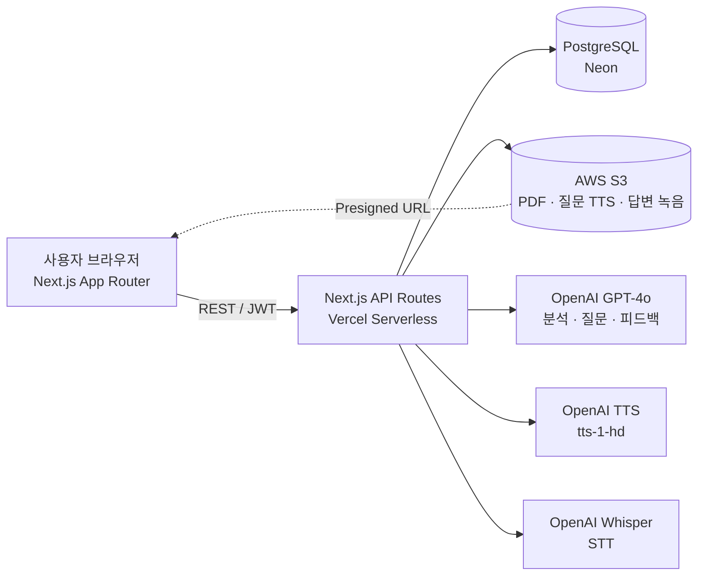

# AI 모의 면접 & 자기소개서 피드백 서비스

> 채용 공고를 분석하고, 사용자의 이력과 공고에 맞춘 **자기소개서 피드백**과 **음성 기반 모의 면접**을 제공하는 AI 취업 준비 서비스


## 1. 프로젝트 개요

| 항목| 내용 |
| --- | --- |
| 프로젝트명 | AI 모의 면접 & 자기소개서 피드백 서비스 |
| 개발 기간 | 2025.09 ~ 2025.12 (저장소의 커밋 · 문서 날짜는 이후 재업로드 시점) |
| 참여 인원 | 1인 |
| 나의 역할<br>&nbsp;&nbsp;&nbsp;&nbsp;&nbsp;&nbsp;&nbsp;&nbsp;&nbsp;&nbsp;&nbsp;&nbsp;&nbsp;&nbsp;&nbsp;&nbsp;&nbsp;&nbsp;&nbsp; | 전체 — 기획, 화면, API Routes 20개, PostgreSQL 테이블 7개, S3 · Vercel 배포 |

채용 공고를 한 번 분석해 저장하고, 그 결과를 자기소개서 피드백과 면접 질문에 다시 씁니다. 면접은 질문 음성 → 최대 60초 녹음 → 음성 인식 → 다음 질문을 5턴 반복하고, 끝나면 질문별 · 종합 피드백을 만듭니다.

| 대시보드 | 채용 공고 분석 (GPT-4o) |
| --- | --- |
|  |  |
| **자기소개서 피드백** | **음성 면접 — 첫 질문** |
|  |  |

> 화면의 채용 공고는 예시로 만든 가상의 공고입니다.

## 2. 기술 스택

| 구분| 기술 |
| --- | --- |
| 사용 언어 | TypeScript |
| 프레임워크 | Next.js 14 (화면 App Router · API Pages Router), React 18, Tailwind CSS |
| 데이터베이스| PostgreSQL(Neon) — ORM 없이 `pg` 커넥션 풀로 직접 쿼리 |
| 개발 도구<br>&nbsp;&nbsp;&nbsp;&nbsp;&nbsp;&nbsp;&nbsp;&nbsp;&nbsp;&nbsp;&nbsp;&nbsp;&nbsp;&nbsp;&nbsp;&nbsp;&nbsp;&nbsp;&nbsp;&nbsp;&nbsp;&nbsp;&nbsp; | OpenAI GPT-4o · TTS(`tts-1-hd`) · Whisper, AWS S3(Presigned URL), JWT · bcrypt, Vercel |

## 3. 시스템 구조



답변 한 번마다 서버리스 함수 한 번(최대 60초) 안에 음성 인식 → 다음 질문 생성 → 음성 합성 → S3 업로드를 처리합니다. 버킷은 공개하지 않고, 음성은 Presigned URL로만 재생합니다.

## 4. 주요 기능

### 핵심 기능

- **채용 공고 분석**: PDF(최대 10MB) 또는 텍스트를 받아 GPT-4o가 회사 · 직무 · 키워드 · 필수/우대 요건 · 요약을 JSON으로 분석합니다.
- **자기소개서 피드백**: 공고 분석을 옆에 띄운 화면에서 작성하고, 점수 대신 강점 · 약점 · 수정 예시 · 예상 면접 질문을 받습니다.
- **음성 모의 면접**: 5개 질문을 음성으로 듣고 답하며, 답변이 1개 이상이면 중간에 끝내고 결과를 볼 수 있습니다.
- **계정 · 히스토리**: JWT 인증, 프로필(현재 직무 · 경력 요약 · 자격증)을 피드백 개인화에 쓰고, 면접 · 자기소개서 · 공고 기록을 조회합니다.

### 기술적 차별점

- **공고 분석 재사용**: 공고는 한 번만 분석해 저장하고, 자기소개서 피드백과 매 턴의 면접 질문 프롬프트에 같은 결과를 넣습니다.
- **LLM 출력 정규화**: 모델이 문자열 자리에 객체를 넣어 보내 화면이 깨진 뒤(React 에러 #31), 서버에서 응답을 스키마에 맞게 고치고 클라이언트에서도 한 번 더 문자열로 바꿉니다.
- **구조화된 피드백 저장**: 면접 턴별 피드백을 자유 텍스트에서 JSONB로 바꾸고, 기존 데이터는 `legacy_feedback`으로 감싸 호환성을 지켰습니다.
- **서버리스에 맞춘 구성**: 커넥션 풀을 인스턴스마다 싱글턴으로 재사용하고, `pg` · `pdf-parse`는 서버리스 번들에서 뺐습니다.

구현 포인트 · 변경 사항 · 설정값 전체는 [docs/IMPLEMENTATION.md](docs/IMPLEMENTATION.md)에 있습니다.

## 5. 문제 해결 사례

### 프롬프트 — 누구에게나 비슷한 면접 질문이 나오던 문제

**직면한 문제**
처음 버전은 기본 프로필(나이 · 성별 · 경력 · 학력)만 넣었고, 두 번째 질문부터는 대화 이력만 넣었습니다. 그래서 지원한 공고나 자기소개서와 상관없이 비슷한 질문이 나왔습니다.

**해결 과정**
매 턴 현재 직무 · 경력 요약 · 자격증, 공고 분석 결과, 자기소개서, 지금까지의 질의응답을 함께 넣도록 바꿨습니다. 질문 전략은 꼬리 질문 · 새 주제 · 상황 질문 세 가지로 명시했고, 생성된 질문이 10자 미만이면 기본 질문으로 바꿉니다.

**결과 및 학습점**
질문이 지원자의 공고와 자기소개서 내용에 맞춰 나오게 됐습니다. 대신 넣는 맥락이 늘어 질문당 토큰은 약 500에서 800~1,000으로 늘었고, 맥락의 양과 비용을 함께 봐야 한다는 것을 배웠습니다.

핵심 코드: [`lib/openai.ts` — `generateInterviewQuestion`](lib/openai.ts)

### DB · 배포 — 배포 후 새 컬럼이 없어 500 에러가 나던 문제

**직면한 문제**
배포 후 면접 시작에서 `column p.current_job does not exist`, `column "voice" ... does not exist` 오류가 났습니다. 코드는 새 컬럼을 쓰는데 운영 DB에는 마이그레이션이 적용되지 않았습니다.

**해결 과정**
`ADD COLUMN IF NOT EXISTS`처럼 여러 번 실행해도 안전한 마이그레이션 SQL과 실행 · 검증 스크립트를 만들고, 기존 행에는 기본값(`nova`)을 채웠습니다. `voice` 컬럼을 넣을 때 쓴 임시 관리자 API는 인증 없이 호출할 수 있어서, 반영 뒤 삭제하고 스크립트(`db:migrate:voice`)로 바꿨습니다.

**결과 및 학습점**
운영 DB 컬럼을 코드와 맞춰 오류가 사라졌고, 인증 없는 관리자 엔드포인트도 남기지 않았습니다. 스키마 변경은 백업 → 적용 → `db:verify:schema` 검증 순서로 하게 됐습니다.

핵심 코드: [`database/migrations/add-voice-column.sql`](database/migrations/add-voice-column.sql) · [`scripts/verify-db-schema.js`](scripts/verify-db-schema.js)

### 배포 — S3 리전을 에러 메시지만 보고 두 번 잘못 고친 문제

**직면한 문제**
배포 환경에서 S3 업로드가 `PermanentRedirect`로 실패했습니다. 에러 메시지에 나온 엔드포인트만 보고 리전을 `ap-northeast-2`에서 `eu-west-2`로 바꿨지만, 그것도 실제 버킷 위치가 아니었습니다.

**해결 과정**
실제 버킷 리전(`ap-southeast-2`)을 확인한 뒤, 코드 기본값과 Vercel 3개 환경의 `AWS_REGION`을 같은 값으로 맞췄습니다.

**결과 및 학습점**
코드 기본값과 3개 환경의 설정이 실제 버킷 위치와 같아졌습니다. 에러 메시지로 추측하기 전에 `aws s3api get-bucket-location`처럼 실제 설정부터 확인해야 한다는 것을 배웠습니다.

핵심 코드: [`lib/s3.ts`](lib/s3.ts)

TTS 재생 실패, 브라우저 자동 재생 정책, Preview CORS, JWT 401 등 전체 10건은 [docs/TROUBLESHOOTING.md](docs/TROUBLESHOOTING.md)에 있습니다.

## 6. 테스트와 검증

- **자동화 테스트는 없습니다.** 기능은 기능별 문서의 수동 테스트 시나리오(조기 종료 답변 0개 · 일부 · 전부, 히스토리 조회 · 삭제, 맥락 기반 질문 체크포인트 등)로 확인했습니다.
- DB는 `npm run db:verify`(user_profiles 컬럼 · 인덱스)와 `npm run db:verify:schema`(전체 테이블 · 컬럼 타입 · 인덱스)로 검증했습니다.
- 장애는 클라이언트 · API 단계별 로그로 원인을 좁혔습니다.

## 7. 배포와 운영

- **Vercel**: Production · Preview · Development 3개 환경에 환경 변수를 따로 두고, `vercel.json`에서 API 함수 최대 실행 시간을 60초로 지정했습니다. Preview 도메인은 CORS 허용 목록에 정규식으로 등록했습니다.
- **DB · 스토리지**: Vercel Storage로 연결한 Neon PostgreSQL, 비공개 S3 버킷(조회는 24시간 Presigned URL).
- 📄 [DEPLOYMENT.md](docs/guides/DEPLOYMENT.md) · [ENVIRONMENT_VARIABLES.md](docs/guides/ENVIRONMENT_VARIABLES.md)

## 8. 실행 방법

```bash
npm install
cp .env.example .env          # DATABASE_URL · AWS · OPENAI_API_KEY · JWT_SECRET
cp .env .env.local            # db:migrate:voice는 .env.local을 읽음

npm run db:migrate            # 새 DB: schema.sql로 전체 스키마 생성 (한 번만)
DATABASE_URL=... npm run db:verify:schema

npm run dev                   # http://localhost:3000
```

기존 DB 업그레이드(`db:migrate:profile` · `db:migrate:feedback` · `db:migrate:voice`)와 배포 절차는 [DEPLOYMENT.md](docs/guides/DEPLOYMENT.md)와 [MIGRATION_GUIDE.md](docs/database/MIGRATION_GUIDE.md)에 있습니다.

## 9. 문서

- [구현 상세](docs/IMPLEMENTATION.md) · [트러블슈팅 10건](docs/TROUBLESHOOTING.md)
- [초기 API 명세](docs/guides/API.md) (MVP 기준, 이후 추가된 엔드포인트와 피드백 형식 변경은 미반영) · [배포 가이드](docs/guides/DEPLOYMENT.md) · [환경 변수](docs/guides/ENVIRONMENT_VARIABLES.md)
- [기능 설계 문서](docs/features) · [DB 문서](docs/database) · [트러블슈팅 원문](docs/troubleshooting) · [문서 목록](docs/README.md)

## License

[MIT](LICENSE)
