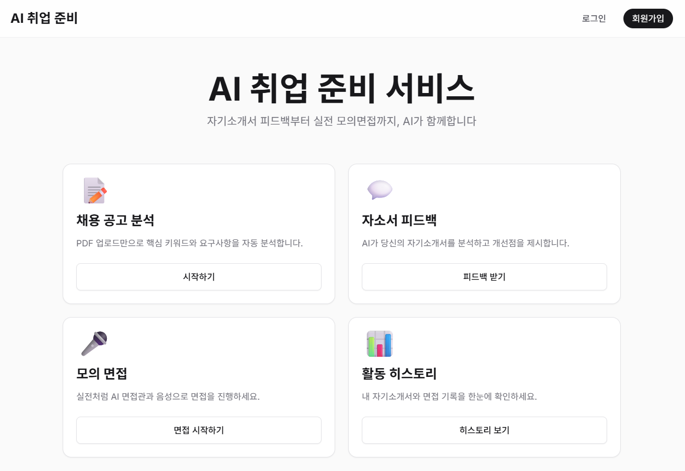
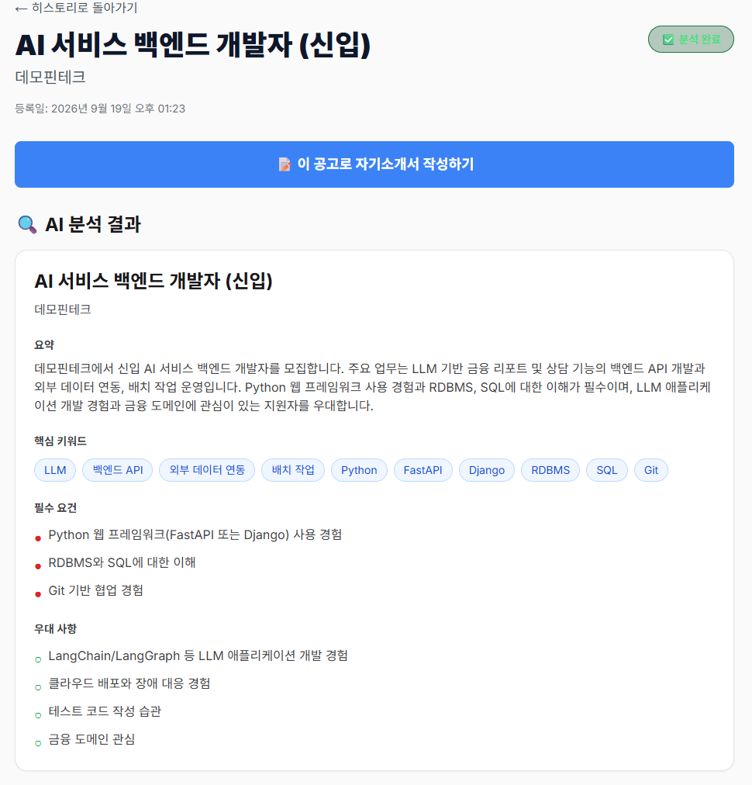
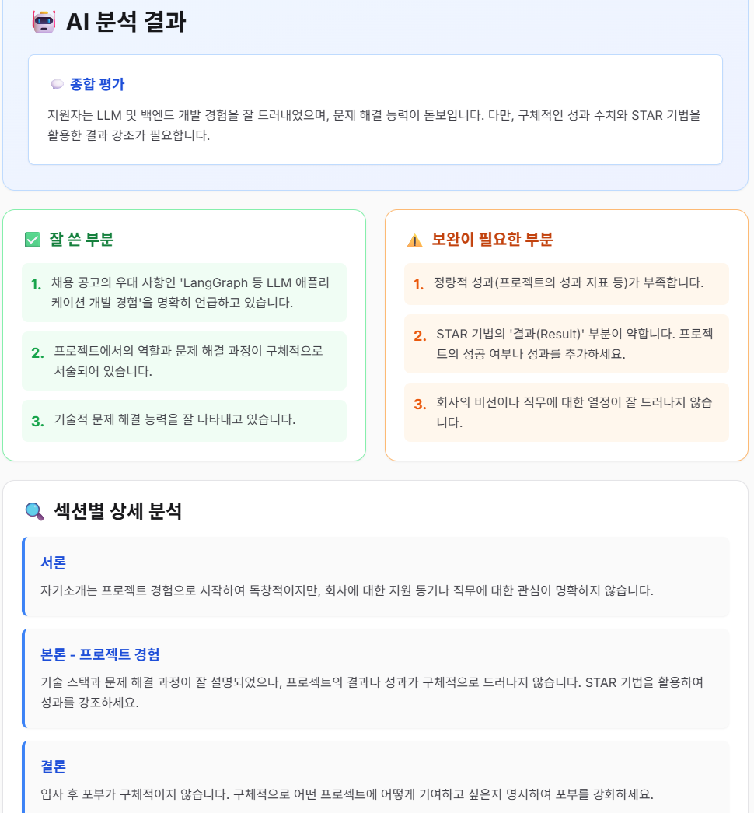
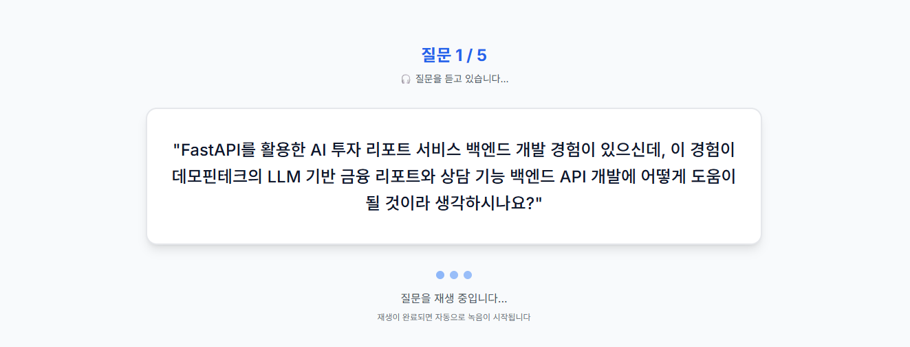
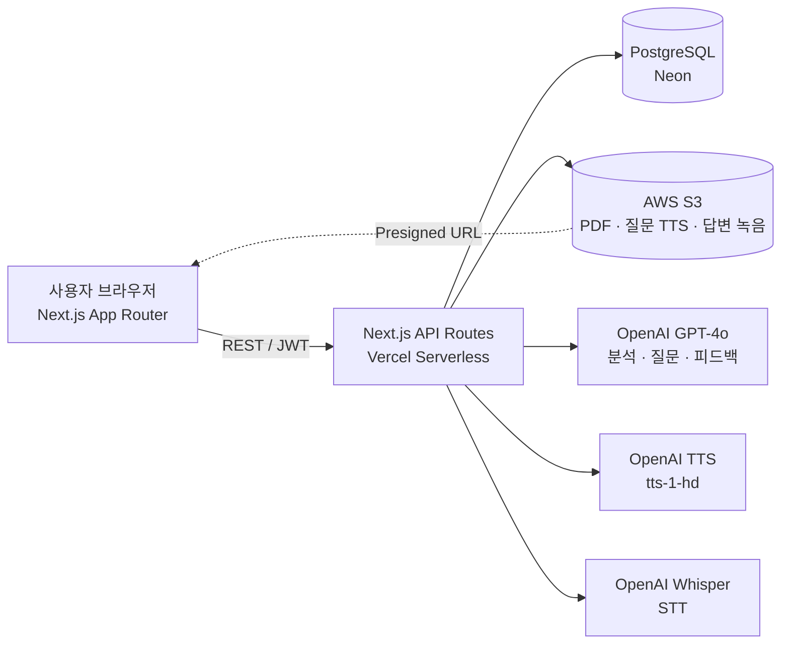
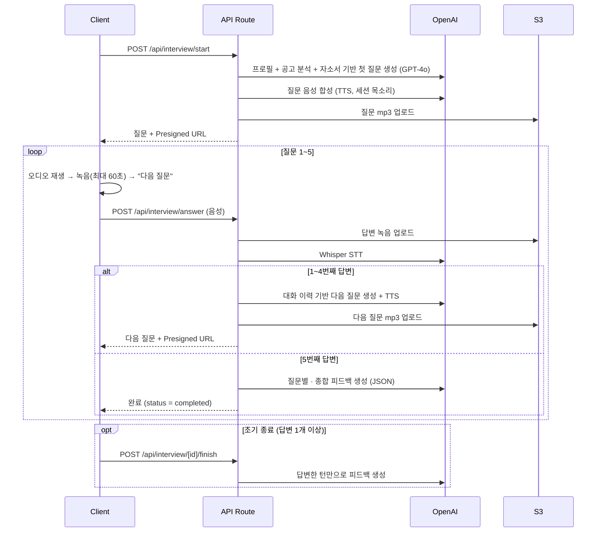

# AI 모의 면접 & 자기소개서 피드백 서비스

> 채용 공고를 분석하고, 사용자의 이력과 공고에 맞춘 **자기소개서 피드백**과 **음성 기반 실시간 모의 면접**을 제공하는 AI 취업 준비 서비스


| 항목| 내용 |
| --- | --- |
| 개발 기간 | 2024.09 ~ 2024.11 |
| 개발 인원 | 1인 (기획 · 프론트엔드 · 백엔드 · 인프라) |
| 배포<br>&nbsp;&nbsp;&nbsp;&nbsp;&nbsp;&nbsp;&nbsp;&nbsp;&nbsp;&nbsp;&nbsp;&nbsp;&nbsp;&nbsp;&nbsp;&nbsp;&nbsp; | Vercel (Serverless Functions) + PostgreSQL(Neon) + AWS S3 |

> 현재 저장소의 커밋·문서 날짜(2025.11~12)는 이후 재업로드 시점이며 실제 개발 기간과 다릅니다.

## 한눈에 보기

| &nbsp;&nbsp;&nbsp;&nbsp;&nbsp;&nbsp;&nbsp;&nbsp;&nbsp;&nbsp;&nbsp;&nbsp;&nbsp; | |
| --- | --- |
| **무엇** | 채용 공고 분석 → 자기소개서 정성 피드백 → **음성 모의 면접**(질문 음성 → 60초 녹음 → 음성 인식 → 다음 질문, 5턴)을 잇는 서비스 |
| **내 역할** | 1인 개발 — 기획, 화면, API Routes 20개, PostgreSQL 테이블 7개, S3 · Vercel 배포 |
| **핵심 ①** | 공고를 한 번 구조화 분석해 저장하고, 자소서 피드백과 면접 질문 프롬프트에 재사용. 모든 턴에 프로필 · 공고 분석 · 자소서 · 대화 이력을 넣어 지원자 맞춤 질문 생성 |
| **핵심 ②** | 점수 대신 정성 피드백(강점 · 개선점 · 수정 예시 · STAR 모범 답안). LLM 출력은 서버에서 스키마로 정규화해 화면이 깨지지 않게 함 |
| **핵심 ③** | 서버리스 60초 안에 STT → GPT → TTS → S3를 처리하고, 비공개 버킷의 음성은 Presigned URL로 재생 |
| **배운 점** | 로컬에서 되던 기능이 배포 환경(S3 리전 오진 2회, Preview CORS, 운영 DB 스키마 불일치, 브라우저 자동 재생 정책)에서 연달아 깨짐 → [트러블슈팅 10건](#-트러블슈팅) |

### 화면

| 대시보드 | 채용 공고 분석 (GPT-4o) |
| --- | --- |
|  |  |
| **자기소개서 피드백** | **음성 면접 — 첫 질문** |
|  |  |

> 화면의 채용 공고는 예시로 만든 가상의 공고입니다.

---

## 목차

1. [주요 기능](#-주요-기능)
2. [시스템 아키텍처](#-시스템-아키텍처)
3. [기술 스택과 설계 선택](#-기술-스택과-설계-선택)
4. [핵심 구현 포인트](#-핵심-구현-포인트)
5. [트러블슈팅](#-트러블슈팅)
6. [주요 변경 사항](#-주요-변경-사항)
7. [배포와 운영](#-배포와-운영)
8. [테스트와 검증](#-테스트와-검증)
9. [프로젝트 구조](#-프로젝트-구조)
10. [실행 방법](#-실행-방법)
11. [문서](#-문서)

---

## ✨ 주요 기능

### 1. 채용 공고 분석
- PDF 업로드(PDF 형식만, 최대 10MB) 또는 텍스트 직접 입력(50 ~ 50,000자)
- `pdf-parse`로 텍스트를 추출하고, GPT-4o가 **회사·직무·핵심 키워드 10개·필수/우대 요건·요약**을 JSON으로 분석
- 원본 PDF는 S3에 저장하고, 분석한 공고는 히스토리에서 조회·선택·삭제 (공고를 지우면 연결된 자기소개서도 함께 삭제)

### 2. 자기소개서 피드백
- 대시보드의 공고 선택 모달이나 공고 선택 페이지에서 공고를 고르면 **Split View**(좌 40% 공고 분석 / 우 60% 작성 영역)에서 요건을 보며 작성
- 사용자 프로필(현재 직무·경력·학력·자격증) + 채용 공고 분석 + 자기소개서를 함께 분석
- 점수 대신 **정성 피드백** 제공: 총평, 강점·약점(각 3~5개), 섹션별 상세 분석, 바로 적용할 수 있는 수정 예시 3개, 예상 면접 질문

### 3. 음성 기반 실시간 모의 면접
- 면접을 시작할 때 작성해 둔 자기소개서 중 하나를 선택
- 면접관 질문을 **OpenAI TTS(tts-1-hd)** 로 들려주고, 세션마다 면접관 목소리 6종 중 하나를 무작위로 배정
- 질문당 **60초** 답변 타이머, 브라우저 녹음(에코 제거·노이즈 억제), **Whisper STT**로 답변을 텍스트로 변환
- 첫 질문은 1분 자기소개·지원 동기·핵심 역량 중 하나, 이후는 대화 이력을 바탕으로 **꼬리 질문 / 새 주제 / 상황 질문** 중 골라 총 **5개 질문**을 생성
- 5개를 다 마치기 전에도 답변이 1개 이상이면 **조기 종료**하고 결과를 볼 수 있음
- 질문별 피드백(답변 요약 · 강점 · 개선점 · 더 나은 답변 예시)과 종합 피드백 제공, 결과 페이지에서 내 답변 녹음 다시 듣기

### 4. 계정 · 프로필 · 히스토리
- JWT 인증(유효기간 7일), bcrypt 비밀번호 해싱
- 게스트도 대시보드는 볼 수 있고, 기능을 누르면 로그인 페이지로 이동
- 프로필(현재 직무, 경력 요약, 자격증 등)을 AI 피드백 개인화에 활용
- 면접, 자기소개서, 채용 공고 기록을 탭별로 조회하고 삭제
- 모바일 우선 반응형 레이아웃 (모바일 햄버거 메뉴)

---

## 🏗 시스템 아키텍처



**모의 면접 흐름**



---

## 🛠 기술 스택과 설계 선택

| 구분| 기술 |
| --- | --- |
| Frontend | Next.js 14 (App Router), React 18, TypeScript, Tailwind CSS |
| Backend<br>&nbsp;&nbsp;&nbsp;&nbsp;&nbsp;&nbsp;&nbsp;&nbsp;&nbsp;&nbsp;&nbsp;&nbsp;&nbsp;&nbsp;&nbsp;&nbsp;&nbsp; | Next.js API Routes (Pages Router, Vercel Serverless Functions) |
| Database | PostgreSQL (`pg` 커넥션 풀로 직접 쿼리), Prisma 스키마(모델 문서화용) |
| Storage | AWS S3 (`@aws-sdk/client-s3`, Presigned URL) |
| AI | OpenAI GPT-4o, TTS(`tts-1-hd`), Whisper(`whisper-1`) |
| Auth | JWT(`jsonwebtoken`), bcrypt |
| Infra | Vercel (API 최대 실행 시간 60초), Neon PostgreSQL |

**설계 선택**
- **App Router 페이지 + Pages Router API**: 화면은 App Router, API는 `pages/api`의 API Routes로 나눴습니다. multipart 업로드를 `formidable`로 직접 파싱하려고 API에서 body parser를 끕니다.
- **ORM 없이 `pg` 직접 쿼리**: 서버리스 인스턴스마다 커넥션 풀을 싱글턴으로 재사용합니다. Prisma 스키마는 모델 정의를 문서화하는 용도이고 런타임에서는 쓰지 않습니다 (`database/schema.sql`이 기준).
- **서버에서 S3 업로드**: PDF와 오디오는 API가 받아 S3에 올리고, 조회는 Presigned URL로만 제공합니다.
- **`pg`, `pdf-parse`는 번들 제외**: `serverComponentsExternalPackages`로 지정해 서버리스 번들 문제를 피했습니다.

---

## 💡 핵심 구현 포인트

### 맥락을 반영한 면접 질문 생성
- MVP에서는 기본 프로필(나이·성별·경력·학력)만 조회했고, 2번째 질문부터는 대화 이력만 넣어 **누구에게나 비슷한 질문**이 나왔습니다.
- 모든 턴에 현재 직무·경력 요약·자격증, **채용 공고 분석 결과(요약·필수/우대 요건·키워드)**, 자기소개서, 지금까지의 질의응답을 함께 넣도록 개편했습니다.
- 질문 전략을 꼬리 질문 / 새 주제에 **상황 질문**을 더한 3가지로 명시하고, 생성된 질문이 10자 미만이면 기본 질문으로 대체해 안정성을 확보했습니다.
- 질문 생성: `temperature 0.7`, `max_tokens 300`(MVP 200) / 공고 분석은 일관성을 위해 `temperature 0.3`
- 컨텍스트가 늘면서 질문당 토큰은 약 500 → 800~1,000으로 증가, 면접 1회(5문항) 비용은 약 $0.01~0.02 **(추정)**
- 📄 [INTERVIEW_CONTEXT_AWARE_REFACTOR.md](docs/features/INTERVIEW_CONTEXT_AWARE_REFACTOR.md)

### 피드백 프롬프트 재설계 (점수 → 정성 피드백)
- MVP는 자기소개서 `overall_score`, 면접 4개 점수(태도·내용·일관성·직무 적합성)를 매겼지만, 점수만으로는 무엇을 고쳐야 할지 알 수 없어 **점수를 모두 제거**했습니다.
- 자기소개서: "수석 채용 담당자" 페르소나, 평가 기준 5개(명확성·직무 적합성·STAR·구체성·차별성), 출력 JSON 예시(few-shot), `response_format: json_object`, `temperature 0.5 → 0.7`
- 면접: 답변한 **모든 턴**에 요약·강점·개선점·STAR 기반 모범 답안을 생성. 조기 종료 시에는 "답변 수가 적다고 감점하지 말라"는 규칙을 프롬프트에 넣었습니다.

### LLM 출력 정규화
- GPT가 문자열 대신 객체를 배열에 넣어 돌려주는 경우가 있었고, 이를 그대로 렌더링하다 **React 에러 #31**(Objects are not valid as a React child)이 발생했습니다.
- 서버에서 응답을 스키마에 맞게 정규화하고(문자열·배열 강제, 객체로 온 항목은 `issue`·`suggestion` 등 필드를 꺼내 문장으로 변환, `improvements`로 바뀐 필드명도 수용, 수정 예시 최대 3개·턴별 강점/개선점 최대 3개), 클라이언트에서도 객체면 문자열로 변환해 렌더링합니다.

### 구조화된 피드백 저장 (TEXT → JSONB)
- 면접 턴별 피드백을 자유 텍스트에서 `user_answer_summary / strengths / improvements / better_answer_example` 구조의 **JSONB**로 바꿨습니다.
- 기존 데이터는 `{"legacy_feedback": ...}`로 감싸 호환성을 지켰고, 조회용 **GIN 인덱스 2개**를 추가했습니다.
- 📄 [MIGRATION_GUIDE.md](docs/database/MIGRATION_GUIDE.md)

### 서버리스 환경에서의 미디어 처리
- TTS 결과는 `response_format: mp3`로 고정하고, 100바이트 미만이면 거부합니다. MP3 헤더가 이상하면 경고 로그를 남깁니다.
- 공개 버킷 대신 **Presigned URL**(24시간)로 제공해 버킷을 공개하지 않고도 재생할 수 있게 했습니다.
- `vercel.json`에서 API 함수 최대 실행 시간을 처음부터 60초로 두어, GPT·TTS·STT를 연달아 호출하는 요청을 처리합니다.

### 한·영 혼합 발음 개선
- TTS 모델을 `tts-1` → `tts-1-hd`로, 속도를 `1.0` → `0.95`로 바꿨습니다.
- 질문을 만드는 단계에서도 "영어 용어에 한국어 조사를 자연스럽게 붙이고, 소리 내어 읽기 좋은 구어체로 쓰라"는 규칙을 프롬프트에 추가했습니다.

### 인증 구조
- 로그인하면 JWT를 `localStorage`에 저장하고, `AuthContext`가 `/api/auth/me`로 토큰을 검증해 전역 로그인 상태를 관리합니다.
- 공개 경로(`/`, `/login`, `/register`)를 뺀 모든 페이지를 `AuthGuard`로 감쌉니다.
- API는 `withAuth`(Bearer 토큰 검증) · `withCors` · `withErrorHandler` 래퍼로 감싸고, 클라이언트는 401을 받으면 토큰을 지우고 로그인 페이지로 보냅니다.
- 프로필은 `INSERT ... ON CONFLICT (user_id) DO UPDATE`(UPSERT)로 저장합니다.

### 안전한 스키마 변경
- 운영 중 컬럼 추가(`current_job`, `career_summary`, `certifications`, `voice`)는 `ADD COLUMN IF NOT EXISTS` 또는 `information_schema`를 확인하는 `DO` 블록으로 **여러 번 실행해도 안전하게** 작성했습니다.
- 절차: 백업 → 마이그레이션 SQL 적용(피드백 JSONB 전환은 트랜잭션) → 검증 스크립트 → 문제 시 롤백 SQL 또는 백업 복원
- 검증: `npm run db:verify`(user_profiles 컬럼·인덱스), `npm run db:verify:schema`(전체 테이블·컬럼 타입·인덱스)
- 📄 [MIGRATION_GUIDELINE.md](docs/database/MIGRATION_GUIDELINE.md) · [DB_SCHEMA_CHECKLIST.md](docs/database/DB_SCHEMA_CHECKLIST.md)

### 데이터 모델
`users` · `user_profiles` · `job_postings` · `cover_letters` · `cover_letter_feedbacks` · `interview_sessions` · `interview_turns`
테이블 7개, 기본 인덱스 9개 + GIN 인덱스 2개, `updated_at` 자동 갱신 트리거 5개 ([schema.sql](database/schema.sql))

---

## 🔥 트러블슈팅

<details>
<summary><b>1. S3 연동 이슈 연쇄: AccessDenied → 리전 오진 2회 → 재생 실패</b></summary>

- **AccessDenied**: IAM 사용자에게 버킷 권한이 없어 업로드 실패 → IAM 정책을 추가
- **PermanentRedirect (1차)**: 코드 기본 리전 `ap-northeast-2`로 접근해 실패 → 에러 메시지의 엔드포인트만 보고 `eu-west-2`로 변경
- **PermanentRedirect (2차)**: `eu-west-2`도 실제 버킷 위치가 아니었음 → 실제 리전(`ap-southeast-2`)을 확인하고 코드 기본값과 Vercel 3개 환경의 `AWS_REGION`을 통일
- **배운 점**: 에러 메시지로 추측하지 말고 `aws s3api get-bucket-location`으로 실제 설정부터 확인
- 📄 [S3_ACCESS_DENIED_FIX.md](docs/troubleshooting/S3_ACCESS_DENIED_FIX.md) · [S3_REGION_FIX.md](docs/troubleshooting/S3_REGION_FIX.md) · [S3_REGION_UPDATE.md](docs/troubleshooting/S3_REGION_UPDATE.md)
</details>

<details>
<summary><b>2. TTS 오디오 재생 실패 (MEDIA_ELEMENT_ERROR: Format error)</b></summary>

- **문제**: 브라우저에서 질문 음성이 재생되지 않음
- **원인**: 오디오 포맷을 지정하지 않았고, 생성 결과를 검증하지 않았으며, 비공개 S3 객체에 접근 권한이 없었음
- **해결**: mp3 포맷 명시, 버퍼 크기 검증, 최종적으로 **Presigned URL 도입**
- 📄 [TTS_AUDIO_FIX.md](docs/troubleshooting/TTS_AUDIO_FIX.md)
</details>

<details>
<summary><b>3. 브라우저 자동 재생 정책 (NotAllowedError)</b></summary>

- **문제**: 사용자 조작 없이 `audio.play()`를 호출하면 브라우저가 차단
- **해결**: 자동 재생이 실패하면 **"🔊 질문 듣기" 폴백 버튼**을 표시. 재생 로직을 `useEffect` 하나로 합치고 100ms 지연, `playsInline`, `preload="auto"`를 적용
- 📄 [TTS_AUTOPLAY_FIX.md](docs/troubleshooting/TTS_AUTOPLAY_FIX.md) · [TTS_AUTOPLAY_REFACTOR.md](docs/troubleshooting/TTS_AUTOPLAY_REFACTOR.md)
</details>

<details>
<summary><b>4. Vercel Preview 배포에서만 발생한 CORS 에러</b></summary>

- **문제**: Preview 도메인에서 로그인하면 CORS 차단
- **원인**: `NEXT_PUBLIC_API_URL`이 모든 환경에서 Production 도메인을 가리켜, Preview가 **다른 도메인의 API**를 호출함
- **해결**: 환경 변수를 제거하고 API 클라이언트를 **상대 경로(`/api`)** 로 변경해 각 배포가 자기 도메인의 API를 호출하도록 함. 여기에 서버의 `withCors` 허용 목록(localhost · Production · Preview 정규식)을 더함
- 📄 [CORS_FIX_GUIDE.md](docs/troubleshooting/CORS_FIX_GUIDE.md)
</details>

<details>
<summary><b>5. 환경 변수 오타로 하드코딩 기본값에 의존</b></summary>

- **문제**: Vercel 변수 이름이 `S3_BuCKET_NAME`(오타)이라 코드가 환경 변수를 읽지 못하고 하드코딩된 기본 버킷 이름으로 동작하고 있었음 (당장은 동작하지만 버킷을 바꾸면 깨지는 잠재 버그)
- **추가 발견**: Vercel Storage 연동으로 자동 생성된 `storage_*` 변수 19개가 섞여 있었음
- **해결**: 오타를 수정하고, 코드가 실제로 쓰는 변수 7개만 남기도록 정리 대상을 정해 문서화 (26개 → 7개)
- 📄 [ENV_VAR_CLEANUP_SUMMARY.md](docs/troubleshooting/ENV_VAR_CLEANUP_SUMMARY.md)
</details>

<details>
<summary><b>6. 녹음 종료 후 "Attempting to use a disconnected port"</b></summary>

- **원인**: `MediaRecorder`를 멈춘 뒤에도 미디어 스트림 트랙이 살아 있었고, 컴포넌트 언마운트 시 정리하지 않았음
- **해결**: `cleanupMediaStream()`에서 모든 트랙을 `stop()`하고, `onstop`과 언마운트 시점에 호출. 60초 타이머가 끝나면 자동 제출하던 방식은 녹음만 멈추고 **"다음 질문" 버튼으로 직접 제출**하도록 바꿈 (listening → recording → waiting_next → processing)
- 📄 [INTERVIEW_UI_REFACTOR.md](docs/features/INTERVIEW_UI_REFACTOR.md)
</details>

<details>
<summary><b>7. 배포 후 스키마 불일치로 500 에러 (임시 관리자 API와 제거)</b></summary>

- **문제**: `column p.current_job does not exist`, `column "voice" ... does not exist`
- **원인**: 코드는 새 컬럼을 사용하는데 프로덕션 DB에는 마이그레이션이 적용되지 않았음
- **해결**: 여러 번 실행해도 안전한 마이그레이션 SQL과 실행·검증 스크립트를 만들고, 기존 행에는 기본값(`nova`)을 채움. `voice` 컬럼은 당시 일회성 관리자 마이그레이션 API로 반영했는데, **인증 없이 호출할 수 있는 엔드포인트**였기 때문에 이후 삭제하고 스크립트(`db:migrate:voice`)로 대체
- 📄 [MIGRATION_GUIDE.md](docs/database/MIGRATION_GUIDE.md) · [VOICE_MIGRATION.md](docs/database/VOICE_MIGRATION.md) · [INTERVIEW_START_DEBUG.md](docs/troubleshooting/INTERVIEW_START_DEBUG.md)
</details>

<details>
<summary><b>8. 면접 결과 조회 시 "아직 완료되지 않은 면접입니다"</b></summary>

- **원인**: 면접을 마쳐도 세션 상태가 `completed`로 바뀌지 않는 경우가 있었음
- **해결**: 완료 처리 `UPDATE ... RETURNING`으로 결과를 확인하도록 함. 조기 종료 시 답변이 없는 마지막 턴은 삭제하고, 답변이 0개면 `cancelled`로 처리
- 📄 [INTERVIEW_RESULT_DEBUG.md](docs/troubleshooting/INTERVIEW_RESULT_DEBUG.md) · [INTERVIEW_EARLY_FINISH.md](docs/features/INTERVIEW_EARLY_FINISH.md)
</details>

<details>
<summary><b>9. 면접 시작 시 JWT 401 오류</b></summary>

- **문제**: 로그인한 상태에서도 `/api/interview/start`가 401을 반환
- **접근**: 원인 후보(토큰 미저장, `'null'` 문자열로 저장된 토큰, 헤더 누락, 환경별 `JWT_SECRET` 불일치)를 나누고, 클라이언트·미들웨어·토큰 추출 단계마다 로그를 넣어 범위를 좁힘
- **조치**: 클라이언트에서 `'null'`·빈 토큰을 걸러내고, `/api/interview/start`는 공통 미들웨어 대신 헤더 확인 → 토큰 추출 → 검증을 순서대로 명시적으로 수행하며 에러 유형(만료·서명 오류)별로 응답하도록 변경. 근본 원인은 문서에 확정 기록이 없음
- 📄 [JWT_AUTH_DEBUG.md](docs/troubleshooting/JWT_AUTH_DEBUG.md)
</details>

<details>
<summary><b>10. Vercel 빌드 실패와 404</b></summary>

- **빌드 실패**: 로컬에서는 넘어가던 코드가 배포 빌드의 타입·린트 검사에서 실패. 쿼리 파라미터·`pathname`의 null 가능성(strict null), ESLint(`import/no-anonymous-default-export`, `exhaustive-deps`), `pdf-parse` 타입 선언(`types/pdf-parse.d.ts`), API 핸들러 반환 타입, `next.config.js`의 잘못된 키, JSX 문법 오류를 하나씩 수정
- **404**: 링크는 있는데 페이지 파일이 없던 경로를 만들고, 존재하지 않는 `/dashboard` 링크를 `/`로 수정. 히스토리 페이지 404는 빌드 캐시(`.next`) 삭제와 강제 재배포로 해결하고 통합 조회 API(`/api/history`)를 추가. favicon 404는 `app/icon.tsx`로 해결
- 📄 [HISTORY_PAGE_SETUP.md](docs/features/HISTORY_PAGE_SETUP.md)
</details>

---

## 📈 주요 변경 사항

### 변경 사항 요약 (Before → After)

| 영역| Before | After |
| --- | --- | --- |
| 면접 질문 | 기본 프로필 + (2번째부터) 대화 이력 | 직무·경력 요약·자격증·**공고 분석·자소서·대화 이력**을 모든 턴에 반영 |
| 답변 제출 | 60초 후 자동 제출 | 녹음 후 "다음 질문" 버튼으로 제출 |
| 면접 종료 | 5개 질문 모두 완료해야 종료 | 답변 1개 이상이면 조기 종료 가능 |
| 피드백 형식 | 점수 중심, TEXT 컬럼 | 점수 제거, 정성 피드백, **JSONB** + GIN 인덱스 |
| TTS | `tts-1`, 속도 1.0, 고정 목소리 | `tts-1-hd`, 속도 0.95, 목소리 6종 랜덤 |
| 오디오 제공 | S3 공개 URL | **Presigned URL** (24시간) |
| API 호출 | `NEXT_PUBLIC_API_URL` 절대 경로 | 상대 경로 (`/api`) |
| 환경 변수 | 26개 (오타·중복 포함) | **7개** |
| S3 리전<br>&nbsp;&nbsp;&nbsp;&nbsp;&nbsp;&nbsp;&nbsp;&nbsp;&nbsp;&nbsp;&nbsp;&nbsp;&nbsp;&nbsp;&nbsp;&nbsp;&nbsp;&nbsp;&nbsp;&nbsp; | `ap-northeast-2` → `eu-west-2` (둘 다 오진) | `ap-southeast-2` (실제 버킷 위치) |
| UI | 다크 모드 → 라이트 테마(blue-600) | 모던 SaaS (Zinc, Inter, 글래스모피즘 헤더) |

### 주요 설정값

| 항목 | 값|
| --- | --- |
| 면접 질문 수 / 답변 시간 | 5개 / 60초 |
| GPT-4o temperature | 공고 분석 0.3 · 자소서·질문·피드백 0.7 |
| 질문 생성 max_tokens | 300 |
| Vercel API 최대 실행 시간 | 60초 |
| DB 커넥션 풀 | 최대 20 · idle 30초 · 연결 타임아웃 2초 |
| JWT 만료 / bcrypt salt rounds | 7일 / 10 |
| S3 Presigned URL (조회) | 24시간 |
| 업로드 제한 | PDF 10MB · 텍스트 50 ~ 50,000자 |
| API 라우트 / DB 테이블 | 20개 / 7개 |

---

## 🚢 배포와 운영

- **Vercel 3개 환경**: Production · Preview · Development 환경별로 환경 변수를 설정(`AWS_REGION` 등). Preview 도메인은 CORS 허용 목록에 정규식으로 등록
- **`vercel.json`**: `pages/api/**` 함수의 `maxDuration` 60초
- **재배포**: 환경 변수 변경이나 빌드 캐시 문제 시 `vercel --prod --force`로 강제 재배포
- **운영 스크립트**: 개발 중에는 Vercel CLI를 호출하는 PowerShell 스크립트로 배포, 환경 변수 정리, 프로덕션 마이그레이션, 프로덕션 API 점검을 수행
- **DB**: Vercel Storage로 연결한 Neon PostgreSQL. 스키마 변경은 [안전한 스키마 변경](#안전한-스키마-변경) 절차로 반영
- 📄 [DEPLOYMENT.md](docs/guides/DEPLOYMENT.md) · [ENVIRONMENT_VARIABLES.md](docs/guides/ENVIRONMENT_VARIABLES.md)

---

## 🧪 테스트와 검증

- **자동화 테스트는 없습니다.** (테스트 프레임워크·CI 미구성)
- 기능별 문서에 **수동 테스트 시나리오**와 체크리스트를 정리해 두고 기능을 확인했습니다. 예: 조기 종료(답변 0개 / 일부 / 전부), 면접 종료 버튼 상태, 히스토리 조회·삭제, 맥락 기반 질문 체크포인트(현재 직무·자소서·필수 요건이 질문에 반영되는지)
- DB는 `db:verify`, `db:verify:schema` 스크립트로 테이블·컬럼 타입·인덱스를 검증했습니다.
- 장애는 클라이언트·API 단계별 상세 로그로 원인을 좁혔습니다 (JWT 401, 면접 시작 실패, TTS 재생 등).

---

## 📁 프로젝트 구조

```
.
├── app/                    # Next.js App Router (페이지)
│   ├── cover-letters/      #   자기소개서 목록 · 공고 선택 · 작성(Split View) · 결과
│   ├── interview/          #   모의 면접 진행 · 결과
│   ├── job-postings/       #   공고 업로드 · 상세 · 히스토리
│   ├── history/            #   통합 히스토리
│   ├── profile/            #   프로필
│   └── login/, register/   #   인증
├── components/             # UI 컴포넌트 (면접, 오디오, 타이머, 공고 분석, 공고 선택 모달, AuthGuard 등)
├── context/                # AuthContext (전역 인증 상태)
├── lib/                    # 서버·클라이언트 공통 모듈
│   ├── openai.ts           #   GPT-4o 프롬프트 · 응답 정규화, TTS, STT
│   ├── s3.ts               #   S3 업로드 · Presigned URL
│   ├── db.ts               #   PostgreSQL 커넥션 풀
│   ├── auth.ts             #   JWT · bcrypt
│   ├── middleware.ts       #   인증 · CORS · 에러 핸들링 래퍼, multipart 파싱
│   ├── pdf-parser.ts       #   PDF 텍스트 추출
│   └── api-client.ts       #   프론트엔드 API 클라이언트
├── pages/api/              # REST API 20개 (auth, profile, job-postings, cover-letters, interview, history)
├── database/
│   ├── schema.sql          # 전체 스키마 (최신 상태)
│   └── migrations/         # 기존 DB 업그레이드용 증분 마이그레이션 SQL
├── prisma/schema.prisma    # Prisma 스키마 (모델 문서화용)
├── scripts/                # DB 초기화 · 마이그레이션 · 검증 스크립트
└── docs/                   # 가이드 · 기능 설계 · DB · 트러블슈팅 문서
```

---

## 🚀 실행 방법

```bash
# 1. 의존성 설치
npm install

# 2. 환경 변수 설정 (DB, AWS, OpenAI, JWT)
cp .env.example .env
cp .env .env.local      # db:migrate:voice는 .env.local을 읽음

# 3-A. 새 DB: schema.sql에 모든 변경이 반영되어 있으므로 한 번만 실행
npm run db:migrate            # 전체 스키마 생성 (재실행 불가: 인덱스·트리거 중복 에러)
npm run db:verify:schema      # 전체 스키마 검증 (DATABASE_URL을 셸 환경 변수로 지정 필요)

# 3-B. 이전 스키마의 기존 DB 업그레이드
npm run db:migrate:profile    # 프로필 필드 추가 (.env)
npm run db:migrate:feedback   # 피드백 JSONB 전환 (셸 환경 변수 필요)
npm run db:migrate:voice      # 면접관 음성 컬럼 추가 (.env.local)
npm run db:verify             # user_profiles 검증

# 4. 개발 서버
npm run dev                   # http://localhost:3000
```

> `db:migrate:feedback`, `db:verify:schema`는 `.env`를 자동으로 읽지 않습니다. 예: `DATABASE_URL=... npm run db:verify:schema`

| 환경 변수| 설명 |
| --- | --- |
| `DATABASE_URL` | PostgreSQL 연결 문자열 |
| `AWS_REGION` / `S3_BUCKET_NAME` | S3 버킷 리전 / 이름 |
| `AWS_ACCESS_KEY_ID` / `AWS_SECRET_ACCESS_KEY` | S3 접근용 IAM 자격 증명 |
| `OPENAI_API_KEY` | OpenAI API 키 |
| `JWT_SECRET`<br>&nbsp;&nbsp;&nbsp;&nbsp;&nbsp;&nbsp;&nbsp;&nbsp;&nbsp;&nbsp;&nbsp;&nbsp;&nbsp;&nbsp;&nbsp;&nbsp;&nbsp;&nbsp;&nbsp;&nbsp;&nbsp;&nbsp;&nbsp;&nbsp;&nbsp;&nbsp;&nbsp;&nbsp;&nbsp;&nbsp;&nbsp;&nbsp;&nbsp;&nbsp;&nbsp;&nbsp;&nbsp;&nbsp;&nbsp;&nbsp;&nbsp;&nbsp;&nbsp;&nbsp;&nbsp;&nbsp; | JWT 서명 키 (필수, 미설정 시 인증 실패) |

배포 절차는 [DEPLOYMENT.md](docs/guides/DEPLOYMENT.md)를 참고하세요.

---

## 📚 문서

개발 중 작성한 설계, 마이그레이션, 트러블슈팅 기록 30여 건을 [`docs/`](docs/README.md)에 주제별로 정리했습니다.

- [초기 API 명세](docs/guides/API.md) (MVP 기준, 이후 추가된 엔드포인트와 피드백 형식 변경은 미반영) · [배포 가이드](docs/guides/DEPLOYMENT.md) · [환경 변수](docs/guides/ENVIRONMENT_VARIABLES.md) · [디자인 시스템](docs/guides/DESIGN_SYSTEM.md)
- [기능 설계 문서](docs/features) · [DB 문서](docs/database) · [트러블슈팅 문서](docs/troubleshooting)

## License

[MIT](LICENSE)
