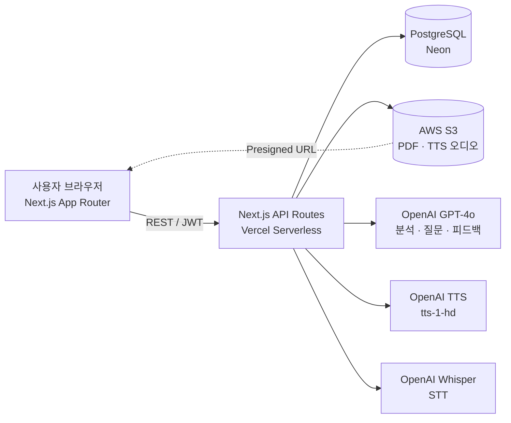
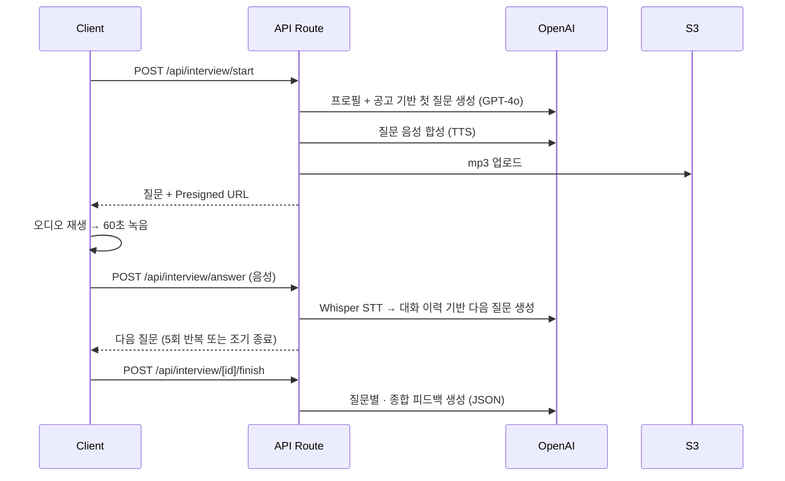

# AI 모의 면접 & 자기소개서 피드백 서비스

> 채용 공고를 분석하고, 사용자의 이력과 공고에 맞춘 **자기소개서 피드백**과 **음성 기반 실시간 모의 면접**을 제공하는 AI 취업 준비 서비스


| 항목 | 내용 |
| --- | --- |
| 개발 기간 | 2025.11.17 ~ 2025.12.03 (집중 개발 3일 + 디자인 개편) |
| 개발 인원 | 1인 (기획 · 프론트엔드 · 백엔드 · 인프라) |
| 커밋 | 100+ |
| 배포 | Vercel (Serverless Functions) + PostgreSQL(Neon) + AWS S3 |

---

## 목차

1. [주요 기능](#-주요-기능)
2. [시스템 아키텍처](#-시스템-아키텍처)
3. [기술 스택](#-기술-스택)
4. [핵심 구현 포인트](#-핵심-구현-포인트)
5. [트러블슈팅](#-트러블슈팅)
6. [개발 과정과 주요 변경 이력](#-개발-과정과-주요-변경-이력)
7. [프로젝트 구조](#-프로젝트-구조)
8. [실행 방법](#-실행-방법)
9. [문서](#-문서)

---

## ✨ 주요 기능

### 1. 채용 공고 분석
- PDF 업로드 또는 텍스트 직접 입력(50 ~ 50,000자)
- `pdf-parse`로 텍스트를 추출하고, GPT-4o가 **핵심 키워드 10개, 필수·우대 요건**을 구조화된 JSON으로 분석
- 원본 PDF는 S3에 저장하고, 분석한 공고는 히스토리에서 조회·선택·삭제

### 2. 자기소개서 피드백
- 분석한 공고를 선택하면 **Split View**(좌 40% 공고 분석 / 우 60% 작성 영역)에서 요건을 보며 작성
- 사용자 프로필(경력·학력·자격증) + 채용 공고 + 자기소개서를 함께 분석
- 점수 대신 **정성 피드백** 제공: 요약, 강점·약점(각 3~5개), 상세 분석, 바로 적용할 수 있는 수정 예시 3개, 예상 면접 질문

### 3. 음성 기반 실시간 모의 면접
- 면접관 질문을 **OpenAI TTS(tts-1-hd)** 로 들려주고, 세션마다 면접관 목소리 6종 중 하나를 무작위로 배정
- 질문당 **60초** 답변 타이머, 브라우저 녹음, **Whisper STT**로 답변을 텍스트로 변환
- 지금까지의 대화, 공고 원문, 사용자 경력을 바탕으로 **꼬리 질문 / 새 주제 / 상황 질문**을 섞어 총 **5개 질문**을 생성
- 5개를 다 마치기 전에도 답변이 1개 이상이면 **조기 종료**하고 결과를 볼 수 있음
- 질문별 피드백(답변 요약 · 강점 · 개선점 · 더 나은 답변 예시)과 종합 피드백 제공

### 4. 계정 · 프로필 · 히스토리
- JWT 인증(유효기간 7일), bcrypt 비밀번호 해싱
- 프로필(현재 직무, 경력 요약, 자격증 등)을 AI 피드백 개인화에 활용
- 면접, 자기소개서, 채용 공고 기록을 탭별로 조회하고 삭제

---

## 🏗 시스템 아키텍처



**모의 면접 한 턴의 흐름**



---

## 🛠 기술 스택

| 구분 | 기술 |
| --- | --- |
| Frontend | Next.js 14 (App Router), React 18, TypeScript, Tailwind CSS |
| Backend | Next.js API Routes (Vercel Serverless Functions) |
| Database | PostgreSQL (`pg` 커넥션 풀), Prisma 스키마 정의 |
| Storage | AWS S3 (`@aws-sdk/client-s3`, Presigned URL) |
| AI | OpenAI GPT-4o, TTS(`tts-1-hd`), Whisper(`whisper-1`) |
| Auth | JWT(`jsonwebtoken`), bcrypt |
| Infra | Vercel (API 최대 실행 시간 60초), Neon PostgreSQL |

---

## 💡 핵심 구현 포인트

### 맥락을 반영한 면접 질문 생성
- 처음에는 나이·성별·경력·학력만 넣어 **누구에게나 비슷한 질문**이 나왔습니다.
- 현재 직무, 경력 요약, 자격증, **채용 공고 원문**, 지금까지의 **질의응답 이력**을 프롬프트에 넣도록 개편했습니다.
- 질문 전략(꼬리 질문 / 새 주제 / 상황 질문)을 명시하고, 생성된 질문이 10자 미만이면 기본 질문으로 대체해 안정성을 확보했습니다.
- 질문 생성: `temperature 0.7`, `max_tokens 300` / 공고 분석은 일관성을 위해 `temperature 0.3`
- 📄 [INTERVIEW_CONTEXT_AWARE_REFACTOR.md](docs/features/INTERVIEW_CONTEXT_AWARE_REFACTOR.md)

### 구조화된 피드백 저장 (TEXT → JSONB)
- 면접 턴별 피드백을 자유 텍스트에서 `user_answer_summary / strengths / improvements / better_answer_example` 구조의 **JSONB**로 바꿨습니다.
- 기존 데이터는 `{"legacy_feedback": ...}`로 감싸 호환성을 지켰고, 조회용 **GIN 인덱스 2개**를 추가했습니다.
- 📄 [MIGRATION_GUIDE.md](docs/database/MIGRATION_GUIDE.md)

### 서버리스 환경에서의 미디어 처리
- TTS 결과는 `response_format: mp3`로 고정하고, 크기(100바이트 이상)와 MP3 헤더를 검증한 뒤 S3에 업로드합니다.
- 공개 버킷 대신 **Presigned URL**(조회 24시간, 업로드 1시간)로 제공해 버킷을 공개하거나 CORS를 따로 설정할 필요를 없앴습니다.
- Vercel 함수 최대 실행 시간을 60초로 늘려 GPT, TTS, STT를 한 번에 호출하는 요청을 처리합니다.

### 한·영 혼합 발음 개선
- 기술 용어가 섞인 질문의 발음을 개선하려고 TTS 모델을 `tts-1` → `tts-1-hd`로, 속도를 `1.0` → `0.95`로 바꿨습니다.

### 안전한 스키마 변경
- 운영 중 컬럼 추가(`current_job`, `career_summary`, `certifications`, `voice`)는 모두 `ADD COLUMN IF NOT EXISTS` 방식으로 **여러 번 실행해도 안전하게** 작성했습니다.
- 검증 스크립트(`npm run db:verify`, `db:verify:schema`)로 반영 여부를 확인합니다.

### 데이터 모델
`users` · `user_profiles` · `job_postings` · `cover_letters` · `cover_letter_feedbacks` · `interview_sessions` · `interview_turns`
테이블 7개, 기본 인덱스 9개 + GIN 인덱스 2개, `updated_at` 자동 갱신 트리거 5개 ([schema.sql](database/schema.sql))

---

## 🔥 트러블슈팅

<details>
<summary><b>1. S3 PermanentRedirect: 리전 불일치</b></summary>

- **문제**: PDF와 오디오 업로드 시 `PermanentRedirect` 에러
- **원인**: 코드의 리전 기본값(`ap-northeast-2` → `eu-west-2`)이 실제 버킷 위치(`ap-southeast-2`)와 달랐음
- **해결**: `aws s3api get-bucket-location`으로 실제 리전을 확인하고, 코드 기본값과 Vercel 3개 환경의 `AWS_REGION`을 `ap-southeast-2`로 통일
- 📄 [S3_REGION_FIX.md](docs/troubleshooting/S3_REGION_FIX.md) · [S3_REGION_UPDATE.md](docs/troubleshooting/S3_REGION_UPDATE.md)
</details>

<details>
<summary><b>2. Vercel Preview 배포에서만 발생한 CORS 에러</b></summary>

- **문제**: Preview 도메인에서 로그인하면 CORS 차단
- **원인**: `NEXT_PUBLIC_API_URL`이 모든 환경에서 Production 도메인을 가리켜, Preview가 **다른 도메인의 API**를 호출함
- **해결**: 환경 변수를 제거하고 API 클라이언트를 **상대 경로(`/api`)** 로 변경해 각 배포가 자기 도메인의 API를 호출하도록 함. 여기에 서버의 `withCors` 허용 목록(localhost · Production · Preview 정규식)을 더함
- 📄 [CORS_FIX_GUIDE.md](docs/troubleshooting/CORS_FIX_GUIDE.md)
</details>

<details>
<summary><b>3. 환경 변수 오타로 인한 잘못된 버킷 사용</b></summary>

- **문제**: 설정한 버킷이 아닌 기본값 버킷으로 업로드됨
- **원인**: Vercel 변수 이름이 `S3_BuCKET_NAME`(오타)이었고, Vercel Storage 연동으로 자동 생성된 `storage_*` 변수 19개가 섞여 있었음
- **해결**: 오타를 수정하고 불필요한 변수를 정리해 **26개 → 7개**로 줄임. 코드가 실제로 쓰는 변수만 남기고 문서화
- 📄 [ENV_VAR_CLEANUP_SUMMARY.md](docs/troubleshooting/ENV_VAR_CLEANUP_SUMMARY.md)
</details>

<details>
<summary><b>4. TTS 오디오 재생 실패 (MEDIA_ELEMENT_ERROR: Format error)</b></summary>

- **문제**: 브라우저에서 질문 음성이 재생되지 않음
- **원인**: 오디오 포맷을 지정하지 않았고, 생성 결과를 검증하지 않았으며, S3 객체 접근 권한과 CORS 설정이 부족했음
- **해결**: mp3 포맷 명시, 버퍼와 헤더 검증, `crossOrigin` 설정, 최종적으로 **Presigned URL 도입**
- 📄 [TTS_AUDIO_FIX.md](docs/troubleshooting/TTS_AUDIO_FIX.md)
</details>

<details>
<summary><b>5. 브라우저 자동 재생 정책 (NotAllowedError)</b></summary>

- **문제**: 사용자 조작 없이 `audio.play()`를 호출하면 브라우저가 차단
- **해결**: 자동 재생이 실패하면 **"🔊 질문 듣기" 폴백 버튼**을 표시. 재생 로직을 `useEffect` 하나로 합치고 100ms 지연, `playsInline`, `preload="auto"`를 적용
- 📄 [TTS_AUTOPLAY_FIX.md](docs/troubleshooting/TTS_AUTOPLAY_FIX.md) · [TTS_AUTOPLAY_REFACTOR.md](docs/troubleshooting/TTS_AUTOPLAY_REFACTOR.md)
</details>

<details>
<summary><b>6. 녹음 종료 후 "Attempting to use a disconnected port"</b></summary>

- **원인**: `MediaRecorder`를 멈춘 뒤에도 미디어 스트림 트랙이 살아 있었고, 컴포넌트 언마운트 시 정리하지 않았음
- **해결**: `cleanupMediaStream()`에서 모든 트랙을 `stop()`하고, `onstop`과 언마운트 시점에 호출. 60초 후 자동 제출하던 방식은 **"다음 질문" 버튼으로 직접 제출**하도록 바꿈 (listening → recording → waiting_next → processing)
- 📄 [INTERVIEW_UI_REFACTOR.md](docs/features/INTERVIEW_UI_REFACTOR.md)
</details>

<details>
<summary><b>7. 배포 후 스키마 불일치로 500 에러</b></summary>

- **문제**: `column p.current_job does not exist`, `column "voice" ... does not exist`
- **원인**: 코드는 새 컬럼을 사용하는데 프로덕션 DB에는 마이그레이션이 적용되지 않았음
- **해결**: 여러 번 실행해도 안전한 마이그레이션 SQL과 실행·검증 스크립트를 만들고, 기존 행에는 기본값(`nova`)을 채움
- 📄 [MIGRATION_GUIDE.md](docs/database/MIGRATION_GUIDE.md) · [VOICE_MIGRATION.md](docs/database/VOICE_MIGRATION.md)
</details>

<details>
<summary><b>8. 면접 결과 조회 시 "아직 완료되지 않은 면접입니다"</b></summary>

- **원인**: 면접을 마쳐도 세션 상태가 `completed`로 바뀌지 않는 경우가 있었음
- **해결**: 완료 처리 `UPDATE ... RETURNING`으로 결과를 확인하도록 함. 조기 종료 시 답변이 없는 마지막 턴은 삭제하고, 답변이 0개면 `cancelled`로 처리
- 📄 [INTERVIEW_RESULT_DEBUG.md](docs/troubleshooting/INTERVIEW_RESULT_DEBUG.md) · [INTERVIEW_EARLY_FINISH.md](docs/features/INTERVIEW_EARLY_FINISH.md)
</details>

---

## 📈 개발 과정과 주요 변경 이력

| 날짜 | 단계 | 주요 작업 |
| --- | --- | --- |
| 2025.11.17 | 기반 구축 | 프로젝트 초기 구성, JWT 인증·회원가입·프로필, Vercel 빌드 오류(TS/ESLint) 해결 |
| 2025.11.18 | 기능 확장 · 인프라 안정화 | PDF 업로드/텍스트 입력, 맥락 기반 질문 생성, 면접 UI 리팩터링, 조기 종료, 히스토리 페이지, **S3 리전·CORS·환경 변수 문제 해결** |
| 2025.11.19 | 품질 고도화 | Presigned URL 도입, 피드백 정성화와 JSONB 전환, 공고 관리, Split View, 면접관 목소리 랜덤 배정, 한·영 혼합 TTS, 모바일 반응형 |
| 2025.12.03 | 디자인 개편 | 모던 SaaS(Zinc) 디자인 시스템 전면 적용 (42개 파일), 대시보드 2x2 벤토 그리드 |

### 변경 사항 요약 (Before → After)

| 영역 | Before | After |
| --- | --- | --- |
| 면접 질문 | 기본 프로필(나이·성별·경력·학력) 기반 | 직무·경력 요약·자격증·**공고 원문·대화 이력** 기반 |
| 답변 제출 | 60초 후 자동 제출 | 녹음 후 "다음 질문" 버튼으로 제출 |
| 면접 종료 | 5개 질문 모두 완료해야 종료 | 답변 1개 이상이면 조기 종료 가능 |
| 피드백 형식 | 점수 중심, TEXT 컬럼 | 점수 제거, 정성 피드백, **JSONB** + GIN 인덱스 |
| TTS | `tts-1`, 속도 1.0, 고정 목소리 | `tts-1-hd`, 속도 0.95, 목소리 6종 랜덤 |
| 오디오 제공 | S3 공개 URL | **Presigned URL** (24시간) |
| API 호출 | `NEXT_PUBLIC_API_URL` 절대 경로 | 상대 경로 (`/api`) |
| 환경 변수 | 26개 (오타·중복 포함) | **7개** |
| S3 리전 | `ap-northeast-2` → `eu-west-2` (불일치) | `ap-southeast-2` (실제 버킷 위치) |
| UI | 다크 모드 → 라이트 테마(blue-600) | 모던 SaaS (Zinc, Inter, 글래스모피즘 헤더) |

### 주요 설정값

| 항목 | 값 |
| --- | --- |
| 면접 질문 수 / 답변 시간 | 5개 / 60초 |
| GPT-4o temperature | 공고 분석 0.3 · 자소서·질문·피드백 0.7 |
| 질문 생성 max_tokens | 300 |
| Vercel API 최대 실행 시간 | 60초 |
| DB 커넥션 풀 | 최대 20 · idle 30초 · 연결 타임아웃 2초 |
| JWT 만료 / bcrypt salt rounds | 7일 / 10 |
| S3 Presigned URL | 조회 24시간 · 업로드 1시간 |
| API 라우트 / DB 테이블 | 20개 / 7개 |

---

## 📁 프로젝트 구조

```
.
├── app/                    # Next.js App Router (페이지)
│   ├── cover-letters/      #   자기소개서 목록 · 공고 선택 · 작성(Split View) · 결과
│   ├── interview/          #   모의 면접 진행 · 결과
│   ├── job-postings/       #   공고 업로드 · 상세 · 히스토리
│   ├── history/            #   통합 히스토리
│   ├── profile/            #   프로필
│   └── login/, register/   #   인증
├── components/             # UI 컴포넌트 (면접, 오디오, 타이머, 공고 분석 등)
├── context/                # AuthContext (전역 인증 상태)
├── lib/                    # 서버·클라이언트 공통 모듈
│   ├── openai.ts           #   GPT-4o 프롬프트, TTS, STT
│   ├── s3.ts               #   S3 업로드 · Presigned URL
│   ├── db.ts               #   PostgreSQL 커넥션 풀
│   ├── auth.ts             #   JWT · bcrypt
│   ├── middleware.ts       #   인증 · CORS · 에러 핸들링 래퍼
│   ├── pdf-parser.ts       #   PDF 텍스트 추출
│   └── api-client.ts       #   프론트엔드 API 클라이언트
├── pages/api/              # REST API (auth, profile, job-postings, cover-letters, interview, history)
├── database/
│   ├── schema.sql          # 전체 스키마
│   └── migrations/         # 증분 마이그레이션 SQL
├── prisma/schema.prisma    # Prisma 스키마 정의
├── scripts/                # DB 초기화 · 마이그레이션 · 검증 스크립트
└── docs/                   # 가이드 · 기능 설계 · DB · 트러블슈팅 문서
```

---

## 🚀 실행 방법

```bash
# 1. 의존성 설치
npm install

# 2. 환경 변수 설정
cp .env.example .env    # 값 채우기 (DB, AWS, OpenAI, JWT)

# 3. DB 스키마 생성 및 마이그레이션
npm run db:migrate            # 전체 스키마
npm run db:migrate:profile    # 프로필 필드 추가
npm run db:migrate:feedback   # 피드백 JSONB 전환
npm run db:migrate:voice      # 면접관 음성 컬럼 추가
npm run db:verify             # 검증

# 4. 개발 서버
npm run dev                   # http://localhost:3000
```

| 환경 변수 | 설명 |
| --- | --- |
| `DATABASE_URL` | PostgreSQL 연결 문자열 |
| `AWS_REGION` / `S3_BUCKET_NAME` | S3 버킷 리전 / 이름 |
| `AWS_ACCESS_KEY_ID` / `AWS_SECRET_ACCESS_KEY` | S3 접근용 IAM 자격 증명 |
| `OPENAI_API_KEY` | OpenAI API 키 |
| `JWT_SECRET` | JWT 서명 키 (필수, 미설정 시 인증 실패) |

배포 절차는 [DEPLOYMENT.md](docs/guides/DEPLOYMENT.md)를 참고하세요.

---

## 📚 문서

개발 중 작성한 설계, 마이그레이션, 트러블슈팅 기록 30여 건을 [`docs/`](docs/README.md)에 주제별로 정리했습니다.

- [API 명세](docs/guides/API.md) · [배포 가이드](docs/guides/DEPLOYMENT.md) · [환경 변수](docs/guides/ENVIRONMENT_VARIABLES.md) · [디자인 시스템](docs/guides/DESIGN_SYSTEM.md)
- [기능 설계 문서](docs/features) · [DB 문서](docs/database) · [트러블슈팅 문서](docs/troubleshooting)

## License

[MIT](LICENSE)
