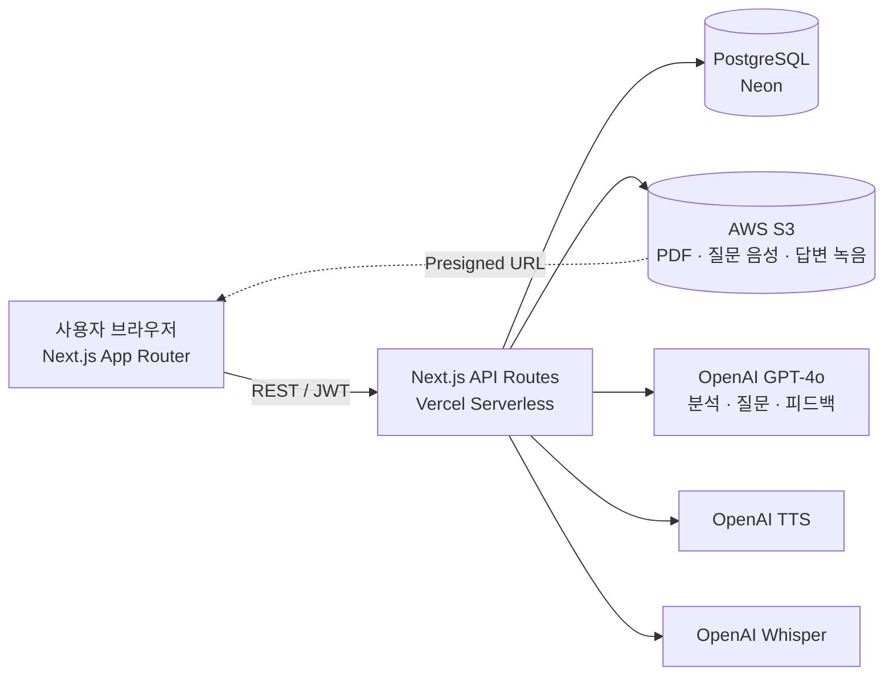
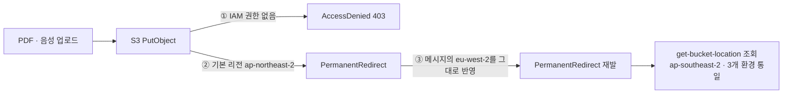
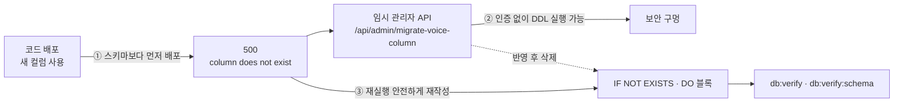
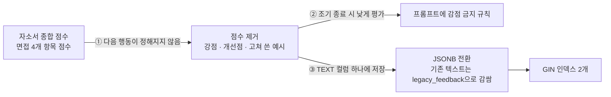
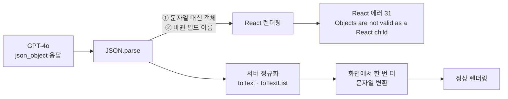

# AI 모의 면접

채용 공고를 한 번 분석해 두고, 그 결과를 자기소개서 피드백과 음성 모의 면접에 다시 쓰는 서비스입니다.


| 대시보드 | 채용 공고 분석 |
| --- | --- |
|  |  |
| **자기소개서 피드백** | **음성 면접** |
|  |  |

> 화면의 채용 공고는 예시로 만든 가상의 공고입니다.

## 개요

| 항목 | 내용 |
| --- | --- |
| 기간 | 2025년 9월 ~ 12월 |
| 인원과 역할 | 1인. 기획, 화면, API, 데이터베이스 설계, 배포를 모두 직접 했습니다 |
| 상태 | 완료 |
| 핵심 기술 | Next.js 14 · TypeScript · PostgreSQL(Neon) · AWS S3 · OpenAI GPT-4o / TTS / Whisper · Vercel |

취업 준비를 하면서 자기소개서와 면접 준비가 따로 도는 것이 불편했습니다. 같은 공고를 보고 자기소개서를 쓰는데 면접 연습에서는 그 내용이 전혀 반영되지 않았습니다.

그래서 공고를 한 번만 분석해 저장해 두고 그 결과를 계속 다시 쓰도록 만들었습니다. 자기소개서를 쓸 때 공고 분석 결과를 옆에 띄우고, 면접 질문을 만들 때도 같은 분석 결과와 작성한 자기소개서를 함께 넣습니다. 그러면 지원자마다 다른 질문이 나옵니다.

면접은 질문 음성을 듣고 최대 60초 녹음한 뒤 다음 질문으로 넘어가는 것을 5번 반복합니다. 끝나면 질문별 피드백과 종합 피드백을 줍니다.

## 아키텍처


```mermaid
flowchart LR
    U["사용자 브라우저<br/>Next.js App Router"] -->|"REST / JWT"| API["Next.js API Routes<br/>Vercel Serverless"]
    API --> DB[("PostgreSQL<br/>Neon")]
    API --> S3[("AWS S3<br/>PDF · 질문 음성 · 답변 녹음")]
    API --> GPT["OpenAI GPT-4o<br/>분석 · 질문 · 피드백"]
    API --> TTS["OpenAI TTS"]
    API --> STT["OpenAI Whisper"]
    S3 -. "Presigned URL" .-> U
```

- 답변 한 번마다 서버리스 함수 한 번 안에서 음성 인식, 다음 질문 생성, 음성 합성, S3 업로드를 모두 처리합니다. 그래서 `vercel.json`에서 API 함수 최대 실행 시간을 처음부터 60초로 잡았습니다.
- 서버리스라 인스턴스가 여러 개 뜹니다. 커넥션 풀은 인스턴스마다 싱글턴으로 재사용하고, `pg`와 `pdf-parse`는 번들에서 제외했습니다.
- 사용자가 채용 공고와 자기소개서를 PDF로 올리면 `pdf-parse`로 텍스트를 뽑아 분석에 씁니다. PDF는 S3에 보관합니다.
- 면접 질문은 매 턴 현재 직무, 경력 요약, 자격증, 공고 분석 결과, 자기소개서, 지금까지의 질의응답을 함께 넣어 만듭니다.

## 기술 스택

| 구분 | 기술 | 선택한 이유 |
| --- | --- | --- |
| 언어 | TypeScript | 화면과 API를 한 저장소에서 다루면서 타입을 공유하려고 썼습니다 |
| 프레임워크 | Next.js 14 (화면 App Router, API Pages Router), React 18, Tailwind CSS | 1인 개발이라 프런트와 API를 한곳에서 관리하는 편이 빨랐습니다 |
| 데이터베이스 | PostgreSQL (Neon), `pg` 커넥션 풀로 직접 쿼리 | 테이블 7개 규모라 ORM을 두지 않고 쿼리를 직접 썼습니다 |
| AI | OpenAI GPT-4o, TTS(tts-1-hd), Whisper | 공고 분석과 질문 생성, 음성 합성, 음성 인식을 한 공급자로 묶었습니다 |
| 스토리지 | AWS S3 (비공개 버킷 + Presigned URL) | 음성 파일을 공개하지 않으면서 재생할 수 있어야 했습니다 |
| 인증 | JWT, bcrypt | |
| 배포 | Vercel (Production · Preview · Development) | |

## 문제 해결 사례

1. [에러 메시지만 보고 S3 리전을 두 번 잘못 고친 문제를 실제 버킷 위치 확인으로 해결](#1-에러-메시지만-보고-s3-리전을-두-번-잘못-고친-문제를-실제-버킷-위치-확인으로-해결)
2. [배포 후 컬럼이 없어 나던 500을 재실행 안전한 마이그레이션으로 해결하고 인증 없는 관리자 API를 삭제](#2-배포-후-컬럼이-없어-나던-500을-재실행-안전한-마이그레이션으로-해결하고-인증-없는-관리자-api를-삭제)
3. [점수만으로는 무엇을 고칠지 알 수 없던 문제를 구조화된 피드백으로 바꾸고 기존 데이터를 살림](#3-점수만으로는-무엇을-고칠지-알-수-없던-문제를-구조화된-피드백으로-바꾸고-기존-데이터를-살림)
4. [LLM이 문자열 자리에 객체를 넣어 화면이 깨지던 문제를 서버와 화면 양쪽 정규화로 해결](#4-llm이-문자열-자리에-객체를-넣어-화면이-깨지던-문제를-서버와-화면-양쪽-정규화로-해결)

각 사례의 테스트 항목에는 기록이 남아 있는 확인 절차와 DB 검증 스크립트를 적었습니다. 나머지 사례까지 포함한 트러블슈팅 10건 요약은 [docs/TROUBLESHOOTING.md](docs/TROUBLESHOOTING.md)에 있습니다.

### 1. 에러 메시지만 보고 S3 리전을 두 번 잘못 고친 문제를 실제 버킷 위치 확인으로 해결

**문제 흐름**


```mermaid
flowchart LR
  U["PDF · 음성 업로드"] --> A["S3 PutObject"]
  A -->|"① IAM 권한 없음"| E0["AccessDenied 403"]
  A -->|"② 기본 리전 ap-northeast-2"| E1["PermanentRedirect"]
  E1 -->|"③ 메시지의 eu-west-2를 그대로 반영"| E2["PermanentRedirect 재발"]
  E2 --> C["get-bucket-location 조회<br/>ap-southeast-2 · 3개 환경 통일"]
```

**문제 원인**
- 배경: 채용 공고 PDF, 질문 음성, 답변 녹음을 비공개 S3 버킷에 저장. 리전 값은 코드 기본값과 Vercel 환경변수 두 곳에 있음
- 배포 환경에서 업로드가 세 번 연달아 실패
- ① IAM 사용자에게 버킷 권한이 없어 `AccessDenied`(403)
- ② 코드 기본 리전 `ap-northeast-2`가 버킷 리전과 달라 `PermanentRedirect`
- ③ 에러 메시지에 적힌 `eu-west-2`를 버킷 설정과 대조하지 않고 넣어 같은 `PermanentRedirect`가 다시 발생

**해결 과정**
- ① IAM 사용자에게 버킷 정책을 붙임
- ②③ 에러 메시지를 해석하는 대신 `aws s3api get-bucket-location`으로 버킷의 실제 리전(`ap-southeast-2`)을 조회
- 코드 기본값과 Vercel Production · Preview · Development 세 환경의 `AWS_REGION`을 같은 값으로 통일. 버킷을 서울 리전으로 옮기는 방법은 새 버킷 생성과 데이터 복사가 필요해 택하지 않음

**테스트**
- 환경: Vercel Production 배포본
- `vercel --prod --force`로 재배포 → 채용 공고 PDF 업로드 → `vercel logs --prod`에서 `PermanentRedirect`가 남는지 확인

> ✅ **결과** 코드 기본값과 세 환경의 `AWS_REGION`이 실제 버킷 위치와 일치
>
> **배운 점** 에러 메시지로 짐작하기 전에 `get-bucket-location`처럼 실제 설정부터 조회하기

---

### 2. 배포 후 컬럼이 없어 나던 500을 재실행 안전한 마이그레이션으로 해결하고 인증 없는 관리자 API를 삭제

**문제 흐름**


```mermaid
flowchart LR
  D["코드 배포<br/>새 컬럼 사용"] -->|"① 스키마보다 먼저 배포"| E["500<br/>column does not exist"]
  E --> T["임시 관리자 API<br/>/api/admin/migrate-voice-column"]
  T -->|"② 인증 없이 DDL 실행 가능"| R["보안 구멍"]
  E -->|"③ 재실행 안전하게 재작성"| M["IF NOT EXISTS · DO 블록"]
  M --> V["db:verify · db:verify:schema"]
  T -.->|"반영 후 삭제"| M
```

**문제 원인**
- 배경: 운영 중 `user_profiles`에 `current_job`, `career_summary`, `certifications`를, `interview_sessions`에 면접관 목소리용 `voice`를 추가
- 배포 후 프로필 조회와 `POST /api/interview/start`가 `column ... does not exist`로 500
- ① push하면 Vercel이 바로 배포하지만 Neon 스키마는 따로 바꿔야 해서, 코드가 스키마보다 먼저 운영에 나감
- ② `voice` 반영용으로 만든 `POST /api/admin/migrate-voice-column`에 인증이 없어, 주소만 알면 누구나 운영 DB에 DDL 실행 가능
- ③ 처음 정리한 SQL은 두 번째 실행에서 `column "voice" already exists`로 실패

**해결 과정**
- ③ `ADD COLUMN IF NOT EXISTS`와 `information_schema`를 확인하는 `DO` 블록으로 다시 써서 여러 번 실행해도 결과가 같게 함
- ① 적용 스크립트(`db:migrate:profile`, `db:migrate:voice`)와 검증 스크립트(`db:verify`, `db:verify:schema`)를 분리하고, 스키마 변경 절차를 백업(`pg_dump`) → 마이그레이션 SQL 적용 → 검증 스크립트 → 롤백 순서로 고정
- ② 반영이 끝난 뒤 임시 관리자 API를 삭제하고 스크립트로 대체

**테스트**
- 환경: PostgreSQL(Neon), 검증 스크립트로 확인
- 마이그레이션 스크립트 끝에서 `information_schema.columns`를 조회해 `voice`의 타입과 기본값(`'nova'`)을 출력하고, `db:verify` · `db:verify:schema`로 컬럼 타입과 인덱스를 스키마 정의와 대조

> ✅ **결과** 프로필 조회와 면접 시작이 정상 동작하고, 인증 없이 DDL을 실행하던 관리자 엔드포인트는 저장소에서 삭제
>
> **배운 점** 마이그레이션은 두 번 실행돼도 같은 결과가 나와야 하고, 운영 DB를 바꾸는 경로는 임시라도 인증 없이 열지 않기

---

### 3. 점수만으로는 무엇을 고칠지 알 수 없던 문제를 구조화된 피드백으로 바꾸고 기존 데이터를 살림

**문제 흐름**


```mermaid
flowchart LR
  V1["자소서 종합 점수<br/>면접 4개 항목 점수"] -->|"① 다음 행동이 정해지지 않음"| V2["점수 제거<br/>강점 · 개선점 · 고쳐 쓴 예시"]
  V2 -->|"② 조기 종료 시 낮게 평가"| R["프롬프트에 감점 금지 규칙"]
  V2 -->|"③ TEXT 컬럼 하나에 저장"| J["JSONB 전환<br/>기존 텍스트는 legacy_feedback으로 감쌈"]
  J --> G["GIN 인덱스 2개"]
```

**문제 원인**
- 배경: 자기소개서는 종합 점수(`overall_score`), 면접은 태도 · 내용 · 일관성 · 직무 적합성 네 항목 점수를 줌
- ① 72점 같은 숫자를 받아도 다음에 무엇을 고쳐야 할지 정해지지 않음
- ② 답변이 1개 이상이면 면접을 일찍 끝낼 수 있게 바꾸자, 답변 수가 적은 면접을 LLM이 부정적으로 평가
- ③ 턴별 피드백이 `interview_turns.feedback_text` TEXT 컬럼 하나에 있어 강점과 개선점을 따로 꺼낼 수 없었고, 이미 저장된 데이터가 있었음

**해결 과정**
- ① 점수를 모두 제거. 자기소개서는 평가 기준 5가지(명확성 · 직무 적합성 · STAR · 구체성 · 차별성)로 강점, 약점, 고쳐 쓴 예시, 예상 면접 질문을, 면접은 턴마다 요약, 강점, 개선점, STAR 형식 모범 답안을 주도록 변경
- ② 프롬프트에 "질문 수가 적다고 점수를 깎지 말 것", "제공된 질문/답변만 분석할 것" 규칙 추가
- ③ 구조를 `user_answer_summary` / `strengths` / `improvements` / `better_answer_example`로 정하고 JSONB로 전환. 기존 데이터는 변환하지 않고 `{"legacy_feedback": ...}`로 감싸 같은 컬럼에 넣음. 변환은 내용을 잘못 나눌 수 있지만 감싸기는 원문을 그대로 보존
- 조회용 GIN 인덱스 2개를 추가하고, 전환은 `BEGIN` / `COMMIT` 트랜잭션 안에서 수행해 실패하면 `ROLLBACK`

**테스트**
- 환경: PostgreSQL(Neon), 기능 문서에 적은 수동 테스트 시나리오
- 답변 0개일 때 조기 종료 버튼 비활성화, 답변 2개 후 조기 종료 시 2개 질문의 피드백과 `final_feedback_json->'is_early_finish'` 값을 SQL로 확인
- 마이그레이션 스크립트가 JSONB 타입과 GIN 인덱스를 출력하고, `npm run db:verify:schema`로 스키마 정의와 대조

> ✅ **결과** 새 피드백은 항목별로 나뉘어 표시되고, 전환 전에 저장된 피드백도 그대로 읽힘
>
> **배운 점** 평가 결과의 형식이 사용자의 다음 행동을 정하고, 스키마를 바꿀 때 옛 데이터는 변환하지 않고 감싸는 것도 방법

---

### 4. LLM이 문자열 자리에 객체를 넣어 화면이 깨지던 문제를 서버와 화면 양쪽 정규화로 해결

**문제 흐름**


```mermaid
flowchart LR
  L["GPT-4o<br/>json_object 응답"] --> P["JSON.parse"]
  P -->|"① 문자열 대신 객체<br/>② 바뀐 필드 이름"| R["React 렌더링"]
  R --> E["React 에러 31<br/>Objects are not valid as a React child"]
  P --> N["서버 정규화<br/>toText · toTextList"]
  N --> C["화면에서 한 번 더<br/>문자열 변환"]
  C --> OK["정상 렌더링"]
```

**문제 원인**
- 배경: 자기소개서 피드백은 GPT-4o에 `response_format: { type: 'json_object' }`를 걸고 파싱한 값을 화면에 그대로 그림. 화면은 `strengths`, `weaknesses`가 문자열 배열이라고 가정
- 일부 응답에서 화면이 React 에러 #31(`Objects are not valid as a React child`)로 깨짐
- ① 모델이 배열 안에 문자열 대신 `{ issue, suggestion }` 같은 객체를 넣어 보냄
- ② `weaknesses` 대신 `improvements`처럼 필드 이름을 바꿔 보내기도 함. `json_object` 모드는 JSON 문법만 보장하고 필드 이름과 타입은 보장하지 않음

**해결 과정**
- ① 서버(`lib/openai.ts`)의 `toText` · `toTextList`로 객체에서 알려진 필드(`issue`, `suggestion` 등)를 꺼내 문장으로 만들고, 알려진 필드가 없으면 `JSON.stringify`로 남겨 내용을 버리지 않음
- ② 바뀐 필드 이름도 받고(`parsed.weaknesses ?? parsed.improvements`), 배열이 아닌 값은 빈 배열로 바꾸며, 고쳐 쓴 예시와 턴별 강점 · 개선점은 각각 최대 3개로 자름
- 화면에서도 렌더링 직전에 타입을 한 번 더 확인해, 정규화를 거치지 않은 값이 와도 화면 전체가 깨지지 않게 함

> ✅ **결과** 모델이 문자열 자리에 객체를 보내거나 필드 이름을 바꿔도 화면이 깨지지 않고 내용이 문장으로 표시됨
>
> **배운 점** `json_object`는 JSON 문법만 보장하므로, 화면에 넘기기 전에 서버에서 필드 이름과 타입을 맞추기

## 역할과 기여도

혼자 기획부터 배포까지 모두 했습니다.

- API Routes 20개(인증, 공고 분석, 자기소개서 피드백, 면접 진행, 히스토리 조회)를 만들고 `withAuth` · `withCors` · `withErrorHandler` 래퍼로 공통 처리를 묶었습니다.
- PostgreSQL 테이블 7개를 설계했습니다. 기본 인덱스 9개와 GIN 인덱스 2개, `updated_at` 자동 갱신 트리거 5개를 두었습니다.
- 공고 분석 결과를 저장해 두고 자기소개서 피드백과 매 턴 면접 질문에 다시 쓰는 구조를 만들었습니다.
- 질문 음성 생성, 녹음, 음성 인식, 다음 질문 생성을 한 요청 안에서 처리하는 음성 면접 흐름을 만들었습니다.
- 비공개 S3 버킷과 Presigned URL로 음성 파일을 다루고, Vercel 세 환경에 배포하며 환경별 설정을 나눴습니다.

## 실행 방법

```bash
npm install
cp .env.example .env          # DATABASE_URL · AWS · OPENAI_API_KEY · JWT_SECRET
cp .env .env.local

npm run db:migrate            # 새 DB: 전체 스키마 생성 (한 번만)
DATABASE_URL=... npm run db:verify:schema

npm run dev                   # http://localhost:3000
```

기존 데이터베이스 업그레이드와 배포 절차는 [DEPLOYMENT.md](docs/guides/DEPLOYMENT.md)와 [MIGRATION_GUIDE.md](docs/database/MIGRATION_GUIDE.md)에 있습니다.

## 문서

- [구현 상세](docs/IMPLEMENTATION.md) · [트러블슈팅 10건](docs/TROUBLESHOOTING.md)
- [배포 가이드](docs/guides/DEPLOYMENT.md) · [환경 변수](docs/guides/ENVIRONMENT_VARIABLES.md)
- [기능 설계 문서](docs/features) · [DB 문서](docs/database) · [문서 목록](docs/README.md)

## License

[MIT](LICENSE)
