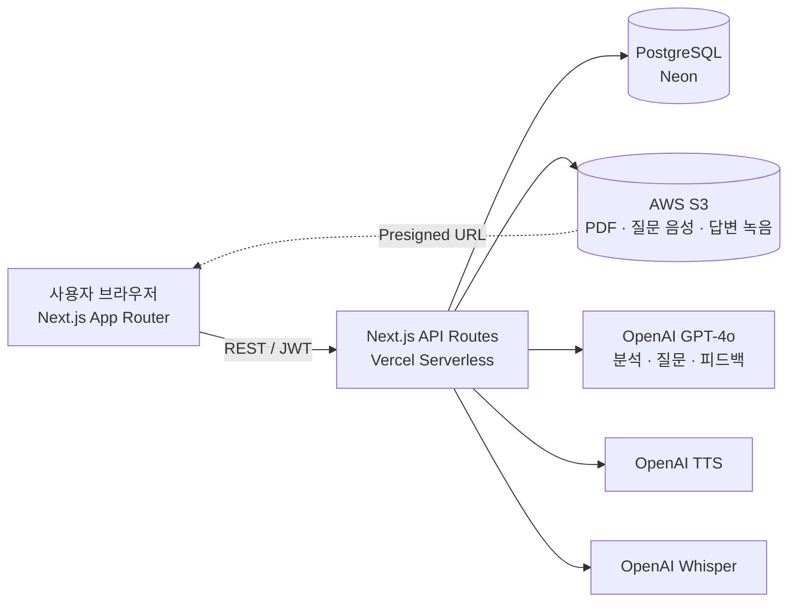

# AI 모의 면접

채용 공고를 한 번 분석해 두고, 그 결과를 자기소개서 피드백과 음성 모의 면접에 다시 쓰는 서비스입니다.


| 대시보드 | 채용 공고 분석 |
| --- | --- |
|  |  |
| **자기소개서 피드백** | **음성 면접** |
|  |  |

> 화면의 채용 공고는 예시로 만든 가상의 공고입니다.

## 개요

| 항목 | 내용 |
| --- | --- |
| 기간 | 2025년 9월 ~ 12월 |
| 인원과 역할 | 1인. 기획, 화면, API, 데이터베이스 설계, 배포를 모두 직접 했습니다 |
| 상태 | 완료 |
| 핵심 기술 | Next.js 14 · TypeScript · PostgreSQL(Neon) · AWS S3 · OpenAI GPT-4o / TTS / Whisper · Vercel |

취업 준비를 하면서 자기소개서와 면접 준비가 따로 도는 것이 불편했습니다. 같은 공고를 보고 자기소개서를 쓰는데 면접 연습에서는 그 내용이 전혀 반영되지 않았습니다.

그래서 공고를 한 번만 분석해 저장해 두고 그 결과를 계속 다시 쓰도록 만들었습니다. 자기소개서를 쓸 때 공고 분석 결과를 옆에 띄우고, 면접 질문을 만들 때도 같은 분석 결과와 작성한 자기소개서를 함께 넣습니다. 그러면 지원자마다 다른 질문이 나옵니다.

면접은 질문 음성을 듣고 최대 60초 녹음한 뒤 다음 질문으로 넘어가는 것을 5번 반복합니다. 끝나면 질문별 피드백과 종합 피드백을 줍니다.

## 문제 해결 사례

1. [에러 메시지만 보고 S3 리전을 두 번 잘못 고친 문제를 실제 버킷 위치 확인으로 해결](#1-에러-메시지만-보고-s3-리전을-두-번-잘못-고친-문제를-실제-버킷-위치-확인으로-해결)
2. [배포 후 컬럼이 없어 나던 500을 재실행 안전한 마이그레이션으로 해결하고 인증 없는 관리자 API를 삭제](#2-배포-후-컬럼이-없어-나던-500을-재실행-안전한-마이그레이션으로-해결하고-인증-없는-관리자-api를-삭제)
3. [점수만으로는 무엇을 고칠지 알 수 없던 문제를 구조화된 피드백으로 바꾸고 기존 데이터를 살림](#3-점수만으로는-무엇을-고칠지-알-수-없던-문제를-구조화된-피드백으로-바꾸고-기존-데이터를-살림)
4. [LLM이 문자열 자리에 객체를 넣어 화면이 깨지던 문제를 서버와 화면 양쪽 정규화로 해결](#4-llm이-문자열-자리에-객체를-넣어-화면이-깨지던-문제를-서버와-화면-양쪽-정규화로-해결)

이 프로젝트에는 자동화 테스트가 없습니다. 나머지 사례까지 포함한 트러블슈팅 10건 요약은 [docs/TROUBLESHOOTING.md](docs/TROUBLESHOOTING.md)에 있습니다.

### 1. 에러 메시지만 보고 S3 리전을 두 번 잘못 고친 문제를 실제 버킷 위치 확인으로 해결

**문제** 배포 환경에서 채용 공고 PDF와 음성 업로드가 `AccessDenied`(403)에 이어 `PermanentRedirect`로 연달아 실패했습니다.

**원인** IAM 권한을 붙인 뒤에는 코드 기본 리전(`ap-northeast-2`)이 버킷 리전과 달랐습니다. 첫 에러 메시지에 적힌 `eu-west-2`를 버킷 설정과 대조하지 않고 그대로 넣어, 같은 `PermanentRedirect`가 다시 났습니다.

**해결**
- 에러 메시지를 해석하는 대신 `aws s3api get-bucket-location`으로 버킷의 실제 리전(`ap-southeast-2`)을 조회했습니다.
- 코드 기본값과 Vercel Production · Preview · Development 세 환경의 `AWS_REGION`을 모두 같은 값으로 맞췄습니다.
- 버킷을 서울 리전으로 옮기는 방법은 새 버킷 생성과 데이터 복사가 필요해 택하지 않았습니다.

**결과** 코드 기본값과 세 환경의 `AWS_REGION`이 실제 버킷 위치와 일치하게 되었습니다.

### 2. 배포 후 컬럼이 없어 나던 500을 재실행 안전한 마이그레이션으로 해결하고 인증 없는 관리자 API를 삭제

**문제** 새 컬럼(`current_job` 등 프로필 필드, `interview_sessions.voice`)을 쓰는 코드가 배포되자 프로필 조회와 면접 시작이 `column ... does not exist`로 500을 냈습니다.

**원인**
- Vercel은 push하면 바로 배포하지만 Neon 스키마는 따로 바꿔야 해서, 코드가 스키마보다 먼저 운영에 나갔습니다.
- 급히 만든 `POST /api/admin/migrate-voice-column`에는 인증이 없어 누구나 운영 DB에 DDL을 실행할 수 있었습니다.
- 처음 SQL은 두 번째 실행에서 `column "voice" already exists`로 실패했습니다.

**해결**
- 마이그레이션을 `ADD COLUMN IF NOT EXISTS`와 `information_schema`를 확인하는 `DO` 블록으로 다시 써서 여러 번 실행해도 결과가 같게 했습니다.
- 적용 스크립트(`db:migrate:profile`, `db:migrate:voice`)와 검증 스크립트(`db:verify`, `db:verify:schema`)를 분리했습니다.
- 반영 후 임시 관리자 API를 삭제하고, 스키마 변경 절차를 백업 → 적용 → 검증 → 롤백 순서로 고정했습니다.

**결과** 프로필 조회와 면접 시작이 정상 동작하고, 인증 없이 DDL을 실행하던 엔드포인트는 저장소에서 사라졌습니다.

### 3. 점수만으로는 무엇을 고칠지 알 수 없던 문제를 구조화된 피드백으로 바꾸고 기존 데이터를 살림

**문제** 자기소개서 종합 점수와 면접 4개 항목 점수를 받아도 사용자가 다음에 무엇을 고쳐야 할지 정해지지 않았습니다.

**원인**
- 평가 결과가 숫자뿐이라 행동으로 이어지지 않았습니다.
- 턴별 피드백이 `feedback_text` TEXT 컬럼 하나에 있어 강점과 개선점을 따로 꺼낼 수 없었고, 이미 쌓인 데이터가 있었습니다.

**해결**
- 점수를 모두 없애고 강점, 개선점, 고쳐 쓴 예시, 예상 면접 질문(면접은 STAR 형식 모범 답안)을 주도록 프롬프트를 바꿨습니다. 조기 종료 시 질문 수로 감점하지 않는 규칙도 넣었습니다.
- 턴별 피드백을 `user_answer_summary` / `strengths` / `improvements` / `better_answer_example` 구조의 JSONB로 바꾸고 GIN 인덱스 2개를 추가했습니다.
- 기존 텍스트는 네 필드로 쪼개지 않고 `{"legacy_feedback": ...}`로 감싸 원문을 보존했고, 전환 SQL은 트랜잭션으로 묶어 실패 시 `ROLLBACK`합니다.

**결과** 새 피드백은 항목별로 나뉘어 표시되고, 전환 전에 저장된 피드백도 잃지 않고 읽힙니다.

### 4. LLM이 문자열 자리에 객체를 넣어 화면이 깨지던 문제를 서버와 화면 양쪽 정규화로 해결

**문제** 자기소개서 피드백 화면이 React 에러 #31(`Objects are not valid as a React child`)로 깨졌습니다.

**원인** `response_format: json_object`는 JSON 문법만 보장합니다. 모델이 문자열 배열 자리에 `{ issue, suggestion }` 같은 객체를 넣거나 `weaknesses`를 `improvements`로 바꿔 보냈고, 파싱한 값을 그대로 화면에 넘기고 있었습니다.

**해결**
- 서버(`lib/openai.ts`)의 `toText` · `toTextList`로 응답을 화면이 기대하는 스키마로 정규화한 뒤 돌려주게 했습니다.
- 바뀐 필드 이름도 받고(`parsed.weaknesses ?? parsed.improvements`), 알려진 필드가 없는 객체는 버리지 않고 `JSON.stringify`로 남깁니다.
- 화면에서도 렌더링 직전에 타입을 한 번 더 확인해, 정규화를 거치지 않은 값이 와도 화면 전체가 깨지지 않게 했습니다.

**결과** 모델이 문자열 자리에 객체를 보내거나 필드 이름을 바꿔도 화면이 깨지지 않고 내용이 문장으로 표시됩니다.

## 아키텍처


```mermaid
flowchart LR
    U["사용자 브라우저<br/>Next.js App Router"] -->|"REST / JWT"| API["Next.js API Routes<br/>Vercel Serverless"]
    API --> DB[("PostgreSQL<br/>Neon")]
    API --> S3[("AWS S3<br/>PDF · 질문 음성 · 답변 녹음")]
    API --> GPT["OpenAI GPT-4o<br/>분석 · 질문 · 피드백"]
    API --> TTS["OpenAI TTS"]
    API --> STT["OpenAI Whisper"]
    S3 -. "Presigned URL" .-> U
```

- 답변 한 번마다 서버리스 함수 한 번 안에서 음성 인식, 다음 질문 생성, 음성 합성, S3 업로드를 모두 처리합니다. 그래서 `vercel.json`에서 API 함수 최대 실행 시간을 처음부터 60초로 잡았습니다.
- 서버리스라 인스턴스가 여러 개 뜹니다. 커넥션 풀은 인스턴스마다 싱글턴으로 재사용하고, `pg`와 `pdf-parse`는 번들에서 제외했습니다.
- 사용자가 채용 공고와 자기소개서를 PDF로 올리면 `pdf-parse`로 텍스트를 뽑아 분석에 씁니다. PDF는 S3에 보관합니다.
- 면접 질문은 매 턴 현재 직무, 경력 요약, 자격증, 공고 분석 결과, 자기소개서, 지금까지의 질의응답을 함께 넣어 만듭니다.

## 기술 스택

| 구분 | 기술 | 선택한 이유 |
| --- | --- | --- |
| 언어 | TypeScript | 화면과 API를 한 저장소에서 다루면서 타입을 공유하려고 썼습니다 |
| 프레임워크 | Next.js 14 (화면 App Router, API Pages Router), React 18, Tailwind CSS | 1인 개발이라 프런트와 API를 한곳에서 관리하는 편이 빨랐습니다 |
| 데이터베이스 | PostgreSQL (Neon), `pg` 커넥션 풀로 직접 쿼리 | 테이블 7개 규모라 ORM을 두지 않고 쿼리를 직접 썼습니다 |
| AI | OpenAI GPT-4o, TTS(tts-1-hd), Whisper | 공고 분석과 질문 생성, 음성 합성, 음성 인식을 한 공급자로 묶었습니다 |
| 스토리지 | AWS S3 (비공개 버킷 + Presigned URL) | 음성 파일을 공개하지 않으면서 재생할 수 있어야 했습니다 |
| 인증 | JWT, bcrypt | |
| 배포 | Vercel (Production · Preview · Development) | |

## 역할과 기여도

혼자 기획부터 배포까지 모두 했습니다.

- API Routes 20개(인증, 공고 분석, 자기소개서 피드백, 면접 진행, 히스토리 조회)를 만들고 `withAuth` · `withCors` · `withErrorHandler` 래퍼로 공통 처리를 묶었습니다.
- PostgreSQL 테이블 7개를 설계했습니다. 기본 인덱스 9개와 GIN 인덱스 2개, `updated_at` 자동 갱신 트리거 5개를 두었습니다.
- 공고 분석 결과를 저장해 두고 자기소개서 피드백과 매 턴 면접 질문에 다시 쓰는 구조를 만들었습니다.
- 질문 음성 생성, 녹음, 음성 인식, 다음 질문 생성을 한 요청 안에서 처리하는 음성 면접 흐름을 만들었습니다.
- 비공개 S3 버킷과 Presigned URL로 음성 파일을 다루고, Vercel 세 환경에 배포하며 환경별 설정을 나눴습니다.

## 결과

**동작 확인** 자동화 테스트는 없습니다. 기능별 문서에 수동 테스트 시나리오를 적어 두고 확인했습니다. 조기 종료에서 답변이 0개, 일부, 전부인 경우, 히스토리 조회와 삭제, 맥락 기반 질문이 나오는지 등입니다. 데이터베이스는 `npm run db:verify`와 `npm run db:verify:schema`로 컬럼 타입과 인덱스까지 검증했습니다. 장애는 클라이언트와 API 단계마다 로그를 넣어 범위를 좁혔습니다.

**질문 품질** 처음에는 기본 프로필만 넣어서 지원자가 달라도 비슷한 질문이 나왔습니다. 매 턴 현재 직무, 경력 요약, 자격증, 공고 분석 결과, 자기소개서, 지금까지의 대화를 함께 넣도록 바꾸자 지원 공고에 맞는 질문이 나왔습니다. 대신 질문당 토큰이 약 500에서 800~1,000으로 늘었습니다. 품질은 질문을 직접 읽어 보고 판단했고, 숫자로 잰 것은 토큰 증가뿐입니다.

**설정 정리** Vercel 환경변수 이름이 `S3_BuCKET_NAME`으로 잘못 적혀 있어 코드가 하드코딩된 기본 버킷 이름으로 동작하고 있었습니다. 당장은 문제가 없지만 버킷을 바꾸면 깨지는 상태였습니다. 오타를 고치고 Vercel Storage 연동으로 자동 생성된 `storage_*` 변수 19개를 정리 대상으로 정해, 실제로 쓰는 변수 7개만 남겼습니다(26개 → 7개).

**주요 설정값**

| 항목 | 값 |
| --- | --- |
| 면접 질문 수 / 답변 시간 | 5개 / 60초 |
| GPT-4o temperature | 공고 분석 0.3, 나머지 0.7 |
| Vercel API 최대 실행 시간 | 60초 |
| DB 커넥션 풀 | 최대 20, idle 30초 |
| JWT 만료 / bcrypt salt rounds | 7일 / 10 |
| S3 Presigned URL | 24시간 |
| 업로드 제한 | PDF 10MB, 텍스트 50~50,000자 |

## 실행 방법

```bash
npm install
cp .env.example .env          # DATABASE_URL · AWS · OPENAI_API_KEY · JWT_SECRET
cp .env .env.local

npm run db:migrate            # 새 DB: 전체 스키마 생성 (한 번만)
DATABASE_URL=... npm run db:verify:schema

npm run dev                   # http://localhost:3000
```

기존 데이터베이스 업그레이드와 배포 절차는 [DEPLOYMENT.md](docs/guides/DEPLOYMENT.md)와 [MIGRATION_GUIDE.md](docs/database/MIGRATION_GUIDE.md)에 있습니다.

## 문서

- [구현 상세](docs/IMPLEMENTATION.md) · [트러블슈팅 10건](docs/TROUBLESHOOTING.md)
- [배포 가이드](docs/guides/DEPLOYMENT.md) · [환경 변수](docs/guides/ENVIRONMENT_VARIABLES.md)
- [기능 설계 문서](docs/features) · [DB 문서](docs/database) · [문서 목록](docs/README.md)

## License

[MIT](LICENSE)
