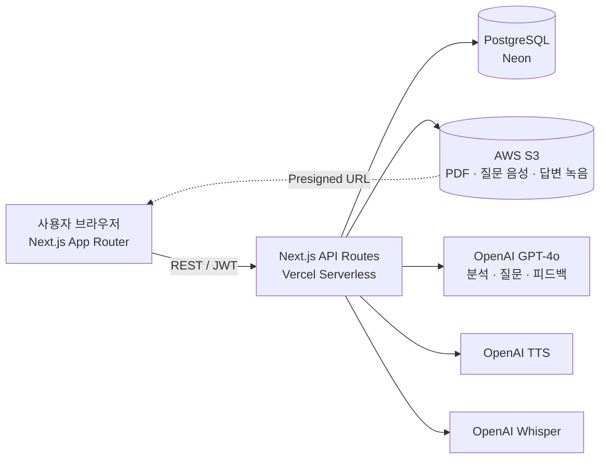
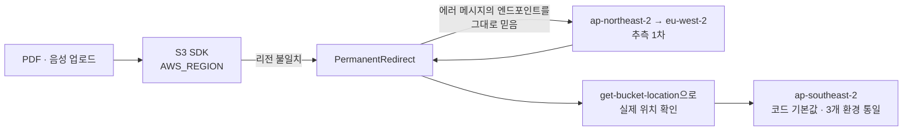
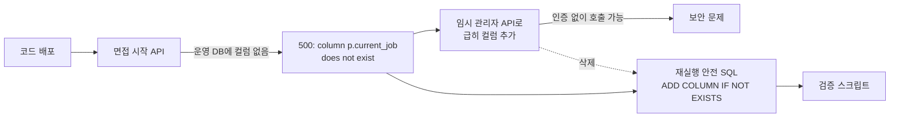
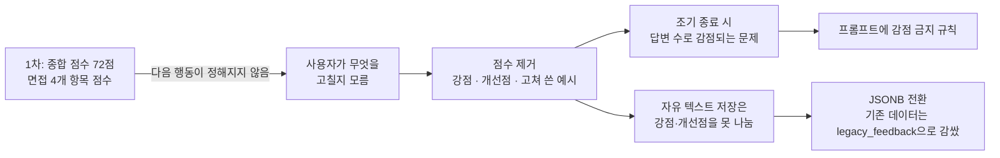

# AI 모의 면접

채용 공고를 한 번 분석해 두고, 그 결과를 자기소개서 피드백과 음성 모의 면접에 다시 쓰는 서비스입니다.


| 대시보드 | 채용 공고 분석 |
| --- | --- |
|  |  |
| **자기소개서 피드백** | **음성 면접** |
|  |  |

> 화면의 채용 공고는 예시로 만든 가상의 공고입니다.

## 프로젝트 목적

취업 준비를 하면서 자기소개서와 면접 준비가 따로 도는 것이 불편했습니다. 같은 공고를 보고 자기소개서를 쓰는데, 면접 연습에서는 그 내용이 전혀 반영되지 않았습니다.

공고를 한 번만 분석해서 저장해 두고 그 결과를 계속 다시 쓰면 이 문제가 풀립니다. 자기소개서를 쓸 때 공고 분석 결과를 옆에 띄우고, 면접 질문을 만들 때도 같은 분석 결과와 작성한 자기소개서를 함께 넣습니다. 그러면 지원자마다 다른 질문이 나옵니다.

피드백을 어떻게 줄지도 문제였습니다. 처음에는 점수를 매겼는데, 72점이라는 숫자를 받아도 무엇을 고쳐야 할지 알 수 없었습니다. 점수를 없애고 강점과 개선점, 그리고 고쳐 쓴 예시를 주는 쪽으로 바꿨습니다.

개발 기간은 2025년 9월부터 12월까지이고 기획부터 배포까지 혼자 했습니다.

## 사용 기술 스택

| 구분 | 기술 | 선택한 이유 |
| --- | --- | --- |
| 언어 | TypeScript | 화면과 API를 한 저장소에서 다루면서 타입을 공유하려고 썼습니다 |
| 프레임워크 | Next.js 14 (화면 App Router, API Pages Router), React 18, Tailwind CSS | 1인 개발이라 프런트와 API를 한곳에서 관리하는 편이 빨랐습니다 |
| 데이터베이스 | PostgreSQL (Neon), `pg` 커넥션 풀로 직접 쿼리 | 테이블 7개 규모라 ORM을 두지 않고 쿼리를 직접 썼습니다 |
| AI | OpenAI GPT-4o, TTS(tts-1-hd), Whisper | 공고 분석과 질문 생성, 음성 합성, 음성 인식을 한 공급자로 묶었습니다 |
| 스토리지 | AWS S3 (비공개 버킷 + Presigned URL) | 음성 파일을 공개하지 않으면서 재생할 수 있어야 했습니다 |
| 인증 | JWT, bcrypt | |
| 배포 | Vercel (Production · Preview · Development) | |

## 아키텍처 구조


```mermaid
flowchart LR
    U[사용자 브라우저<br/>Next.js App Router] -->|REST / JWT| API[Next.js API Routes<br/>Vercel Serverless]
    API --> DB[(PostgreSQL<br/>Neon)]
    API --> S3[(AWS S3<br/>PDF · 질문 음성 · 답변 녹음)]
    API --> GPT[OpenAI GPT-4o<br/>분석 · 질문 · 피드백]
    API --> TTS[OpenAI TTS]
    API --> STT[OpenAI Whisper]
    S3 -. Presigned URL .-> U
```

면접은 질문 음성을 듣고 최대 60초 녹음한 뒤 다음 질문으로 넘어가는 것을 5번 반복합니다. 답변 한 번마다 서버리스 함수 한 번 안에서 음성 인식, 다음 질문 생성, 음성 합성, S3 업로드를 모두 처리해야 했습니다. 함수 실행 시간 제한을 60초로 잡고 시작한 이유입니다.

서버리스라 인스턴스가 여러 개 뜹니다. 커넥션 풀은 인스턴스마다 싱글턴으로 재사용하고, `pg`와 `pdf-parse`는 번들에서 제외했습니다.

## 역할과 기여도

기획, 화면, API, 데이터베이스 설계, 배포를 모두 직접 했습니다.

- API Routes 20개를 만들었습니다. 인증, 공고 분석, 자기소개서 피드백, 면접 진행, 히스토리 조회입니다.
- PostgreSQL 테이블 7개를 설계했습니다. 기본 인덱스 9개와 GIN 인덱스 2개, `updated_at` 자동 갱신 트리거 5개를 두었습니다.
- 공고 분석 결과를 저장해 두고 자기소개서 피드백과 매 턴 면접 질문에 다시 쓰는 구조를 만들었습니다.
- 음성 면접 흐름을 만들었습니다. 질문 음성 생성, 녹음, 음성 인식, 다음 질문 생성을 한 요청 안에서 처리합니다.
- 비공개 S3 버킷과 Presigned URL로 음성 파일을 다뤘습니다.
- Vercel 세 환경에 배포하고 환경별 설정을 나눴습니다.

## 트러블슈팅 해결 과정

### 에러 메시지만 보고 S3 리전을 두 번 잘못 고친 문제를 실제 버킷 위치 확인으로 해결

**문제 흐름**


```mermaid
flowchart LR
  U[PDF · 음성 업로드] --> S3[S3 SDK<br/>AWS_REGION]
  S3 -->|리전 불일치| E[PermanentRedirect]
  E -->|에러 메시지의 엔드포인트를<br/>그대로 믿음| G1[ap-northeast-2 → eu-west-2<br/>추측 1차]
  G1 --> E
  E --> C[get-bucket-location으로<br/>실제 위치 확인]
  C --> F[ap-southeast-2<br/>코드 기본값 · 3개 환경 통일]
```

**문제 원인**

- 배포 환경에서 S3 업로드가 `PermanentRedirect`로 실패했고, 에러 메시지에 다른 엔드포인트가 적혀 있었음
- 그 엔드포인트를 그대로 믿고 `ap-northeast-2`를 `eu-west-2`로 바꿨는데 그것도 실제 버킷 위치가 아니었음
- 근본 원인은 리전 값 자체가 아니라, 확인하지 않고 에러 메시지로 짐작한 것이었음. 한 번 추측으로 고치면 두 번째 시도도 추측이 됨

**해결 과정**

- 추측을 멈추고 `aws s3api get-bucket-location`으로 실제 버킷 리전을 조회함. `ap-southeast-2`였음
- 코드의 기본값과 Vercel 세 환경(Production · Preview · Development)의 `AWS_REGION`을 모두 같은 값으로 맞춤
- 이 과정에서 환경변수 이름 오타로 코드가 하드코딩된 기본값으로 동작하고 있던 것도 함께 발견해 고침

**테스트**

- 환경: Vercel Preview와 Production 배포본
- 세 환경 모두에서 PDF 업로드와 질문 음성 업로드를 실행해 S3 객체가 생성되는지, Presigned URL로 재생되는지 확인
- 실제로 쓰는 변수만 남겨 환경변수를 26개에서 7개로 줄이고, 배포 후 다시 확인

**결과** 세 환경에서 업로드가 모두 성공하고, 버킷을 바꿔도 코드가 아닌 환경변수만 고치면 되는 상태가 됨

**배운 점** 에러 메시지로 짐작하기 전에 실제 설정을 조회해서 확인하기

### 배포 후 컬럼이 없어 500이 나던 문제를 재실행 안전한 마이그레이션으로 해결하고 임시 통로를 회수

**문제 흐름**


```mermaid
flowchart LR
  D[코드 배포] --> A["면접 시작 API"]
  A -->|운영 DB에 컬럼 없음| E["500: column p.current_job<br/>does not exist"]
  E --> T[임시 관리자 API로<br/>급히 컬럼 추가]
  T -->|인증 없이 호출 가능| R[보안 문제]
  E --> M["재실행 안전 SQL<br/>ADD COLUMN IF NOT EXISTS"]
  M --> V[검증 스크립트]
  T -.삭제.-> M
```

**문제 원인**

- 배포 후 면접 시작에서 `column p.current_job does not exist`, 이어서 `column "voice" ... does not exist` 오류가 발생
- 코드는 새 컬럼을 쓰는데 운영 데이터베이스에는 마이그레이션이 적용되지 않은 상태였음. 코드 배포와 스키마 변경이 따로 놀고 있었음
- 급한 마음에 `voice` 컬럼을 넣으려고 임시 관리자 API를 만들었는데, 인증 없이 호출할 수 있는 엔드포인트였음

**해결 과정**

- 여러 번 실행해도 안전한 마이그레이션 SQL로 다시 작성함. `ADD COLUMN IF NOT EXISTS`와 `information_schema` 확인 블록을 씀
- 적용 스크립트와 검증 스크립트를 따로 두고, 기존 행에는 기본값을 채움
- 반영이 끝난 뒤 임시 관리자 API를 삭제하고 스크립트로 대체함
- 이후 스키마 변경 절차를 백업 → 마이그레이션 적용 → 검증 → 문제 시 롤백 순서로 고정함

**테스트**

- 환경: PostgreSQL(Neon), `npm run db:verify`와 `npm run db:verify:schema`
- 전체 테이블, 컬럼 타입, 인덱스를 스키마 정의와 대조
- 같은 마이그레이션을 두 번 실행해도 오류가 나지 않는지 확인

**결과** 면접 시작이 정상 동작하고, 인증 없이 열려 있던 관리자 엔드포인트가 제거됨

**배운 점** 스키마 변경은 재실행해도 안전하게 쓰고, 급하게 만든 통로는 반드시 회수하기

### 점수만으로는 무엇을 고칠지 알 수 없던 문제를 구조화된 피드백으로 바꾸고 기존 데이터를 살림

**문제 흐름**


```mermaid
flowchart LR
  V1["1차: 종합 점수 72점<br/>면접 4개 항목 점수"] -->|다음 행동이 정해지지 않음| P[사용자가 무엇을<br/>고칠지 모름]
  P --> V2[점수 제거<br/>강점 · 개선점 · 고쳐 쓴 예시]
  V2 --> C1["조기 종료 시<br/>답변 수로 감점되는 문제"]
  C1 --> R[프롬프트에 감점 금지 규칙]
  V2 --> C2[자유 텍스트 저장은<br/>강점·개선점을 못 나눔]
  C2 --> J[JSONB 전환<br/>기존 데이터는 legacy_feedback으로 감쌌]
```

**문제 원인**

- 처음 버전은 자기소개서에 종합 점수를, 면접에는 태도 · 내용 · 일관성 · 직무 적합성 네 항목 점수를 줬음
- 점수를 받아도 다음에 무엇을 해야 할지가 정해지지 않았음. 72점이라는 숫자에는 고칠 대상이 없었음
- 점수를 없애고 구조화된 피드백으로 바꾸려 하자 두 가지가 따라옴. 조기 종료를 허용하는데 답변 수가 적으면 LLM이 낮게 평가했고, 피드백이 자유 텍스트 컬럼 하나에 들어 있어 강점과 개선점을 따로 뽑을 수 없었음

**해결 과정**

- 점수를 모두 제거함. 자기소개서는 채용 담당자 관점의 평가 기준 다섯 가지를 두고 강점, 약점, 고쳐 쓴 예시, 예상 면접 질문을 주도록 바꿈
- 면접은 답변한 모든 턴에 요약, 강점, 개선점, STAR 형식 모범 답안을 만들게 함
- 답변 수로 감점하지 말라는 규칙을 프롬프트에 명시해 조기 종료를 불리하게 만들지 않음
- 저장 형식을 `user_answer_summary` / `strengths` / `improvements` / `better_answer_example` 구조의 JSONB로 전환하고, 조회용 GIN 인덱스 2개를 추가함
- 이미 저장된 데이터는 변환하지 않고 `{"legacy_feedback": ...}`로 감싸 같은 컬럼에 넣음. 변환은 실패할 수 있지만 감싸기는 실패하지 않음

**테스트**

- 환경: PostgreSQL(Neon), 기능별 문서에 적어 둔 수동 테스트 시나리오
- 조기 종료에서 답변이 0개, 일부, 전부인 경우를 각각 실행해 피드백이 나오는지와 답변 수로 불이익이 없는지 확인
- `npm run db:verify:schema`로 JSONB 컬럼 타입과 GIN 인덱스를 대조하고, 기존 데이터가 그대로 읽히는지 확인

**결과** 새 데이터는 구조화되어 화면에서 항목별로 나뉘어 보이고, 옛 데이터도 손실 없이 읽힘

**배운 점** 평가 결과의 형식이 사용자의 다음 행동을 정하고, 스키마를 바꿀 때 옛 데이터를 변환하지 않고 감싸는 것도 방법임

트러블슈팅 10건 전체는 [docs/TROUBLESHOOTING.md](docs/TROUBLESHOOTING.md)에 있습니다. TTS 재생 실패, 브라우저 자동 재생 정책, Preview 환경 CORS, JWT 401 등입니다.

## 결과

**동작 확인** 자동화 테스트는 없습니다. 기능별 문서에 수동 테스트 시나리오를 적어 두고 확인했습니다. 조기 종료에서 답변이 0개, 일부, 전부인 경우, 히스토리 조회와 삭제, 맥락 기반 질문이 나오는지 등입니다. 데이터베이스는 `npm run db:verify`와 `npm run db:verify:schema`로 컬럼 타입과 인덱스까지 검증했습니다. 장애는 클라이언트와 API 단계마다 로그를 넣어 범위를 좁혔습니다.

**질문 품질** 처음에는 기본 프로필만 넣어서 지원자가 달라도 비슷한 질문이 나왔습니다. 매 턴 현재 직무, 경력 요약, 자격증, 공고 분석 결과, 자기소개서, 지금까지의 대화를 함께 넣도록 바꾸자 지원 공고에 맞는 질문이 나왔습니다. 대신 질문당 토큰이 약 500에서 800~1,000으로 늘었습니다. 맥락을 늘리면 품질이 오르지만 비용도 오른다는 것을 숫자로 확인했습니다.

**설정 정리** Vercel 환경변수 이름에 오타가 있어 코드가 하드코딩된 기본값으로 동작하고 있었습니다. 당장은 문제가 없지만 버킷을 바꾸면 깨지는 상태였습니다. 오타를 고치고 실제로 쓰는 변수만 남겨 26개에서 7개로 줄였습니다.

**주요 설정값**

| 항목 | 값 |
| --- | --- |
| 면접 질문 수 / 답변 시간 | 5개 / 60초 |
| GPT-4o temperature | 공고 분석 0.3, 나머지 0.7 |
| Vercel API 최대 실행 시간 | 60초 |
| DB 커넥션 풀 | 최대 20, idle 30초 |
| JWT 만료 / bcrypt salt rounds | 7일 / 10 |
| S3 Presigned URL | 24시간 |
| 업로드 제한 | PDF 10MB, 텍스트 50~50,000자 |

## 실행 방법

```bash
npm install
cp .env.example .env          # DATABASE_URL · AWS · OPENAI_API_KEY · JWT_SECRET
cp .env .env.local

npm run db:migrate            # 새 DB: 전체 스키마 생성 (한 번만)
DATABASE_URL=... npm run db:verify:schema

npm run dev                   # http://localhost:3000
```

기존 데이터베이스 업그레이드와 배포 절차는 [DEPLOYMENT.md](docs/guides/DEPLOYMENT.md)와 [MIGRATION_GUIDE.md](docs/database/MIGRATION_GUIDE.md)에 있습니다.

## 문서

- [구현 상세](docs/IMPLEMENTATION.md) · [트러블슈팅 10건](docs/TROUBLESHOOTING.md)
- [배포 가이드](docs/guides/DEPLOYMENT.md) · [환경 변수](docs/guides/ENVIRONMENT_VARIABLES.md)
- [기능 설계 문서](docs/features) · [DB 문서](docs/database) · [문서 목록](docs/README.md)

## License

[MIT](LICENSE)
