# AI 모의 면접

채용 공고를 한 번 분석해 두고, 그 결과를 자기소개서 피드백과 음성 모의 면접에 다시 쓰는 서비스입니다.


| 대시보드 | 채용 공고 분석 |
| --- | --- |
| 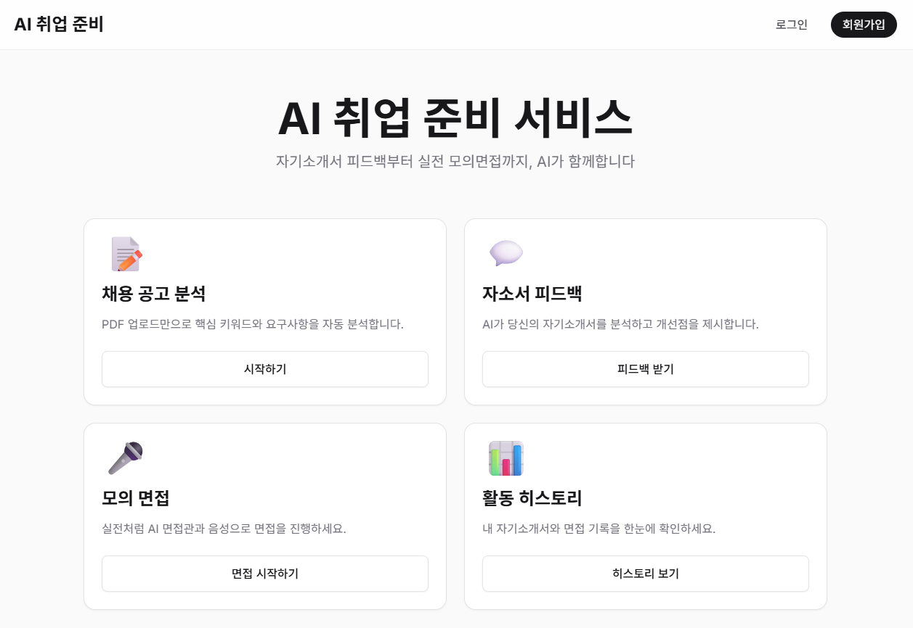 | 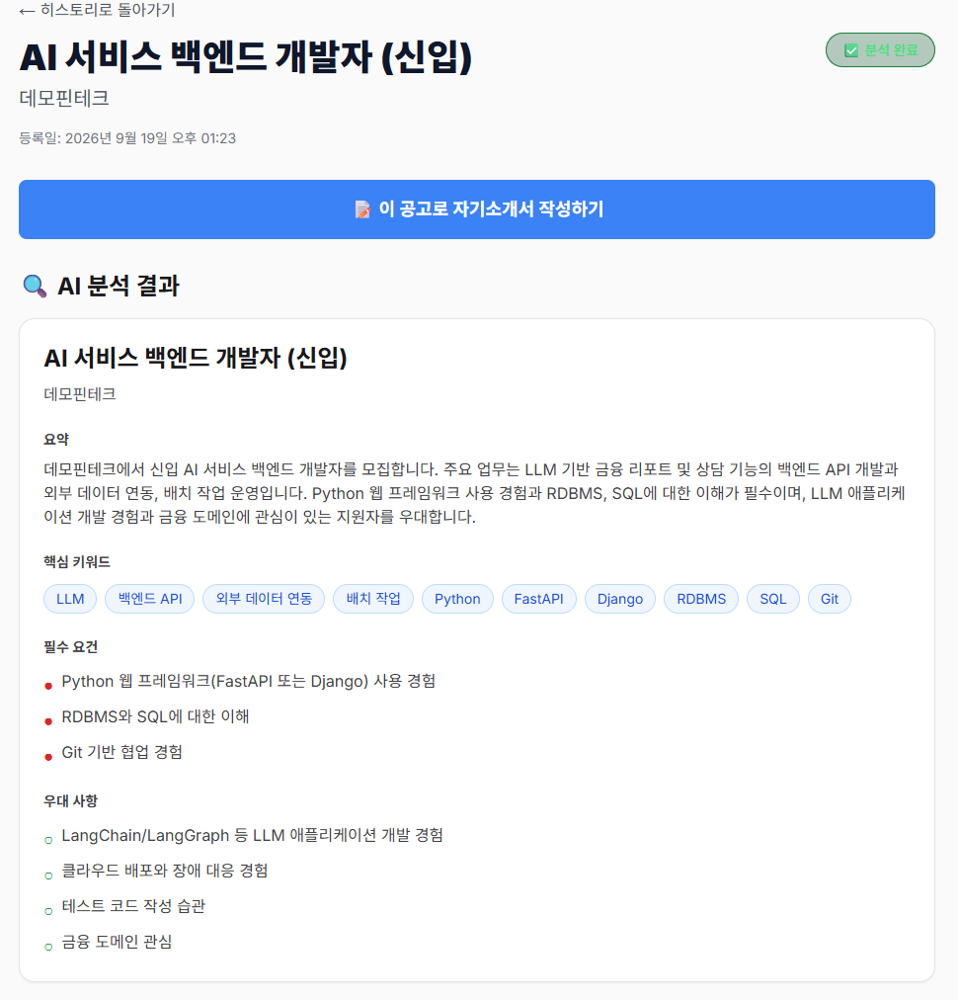 |
| **자기소개서 피드백** | **음성 면접** |
| 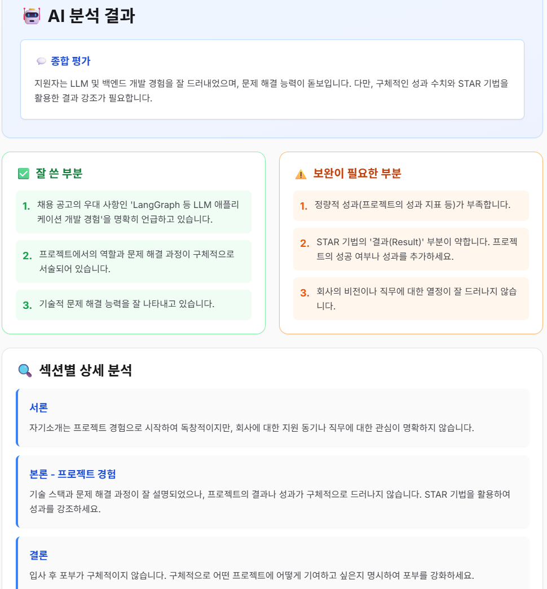 | 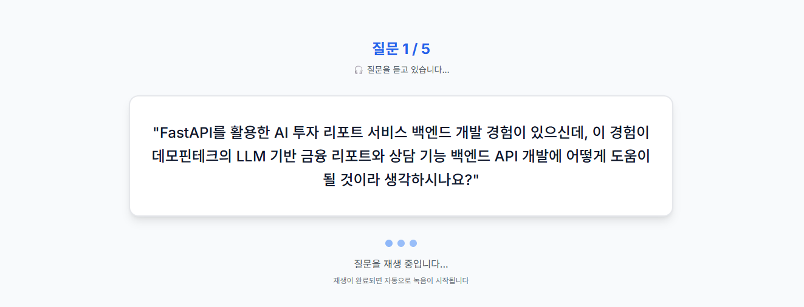 |

> 화면의 채용 공고는 예시로 만든 가상의 공고입니다.

## 개요

| 항목 | 내용 |
| --- | --- |
| 기간 | 2025년 9월 ~ 12월 |
| 인원과 역할 | 1인. 기획, 화면, API, 데이터베이스 설계, 배포를 모두 직접 했습니다 |
| 상태 | 완료 |
| 핵심 기술 | Next.js 14 · TypeScript · PostgreSQL(Neon) · AWS S3 · OpenAI GPT-4o / TTS / Whisper · Vercel |

취업 준비를 하면서 자기소개서와 면접 준비가 따로 도는 것이 불편했습니다. 같은 공고를 보고 자기소개서를 쓰는데 면접 연습에서는 그 내용이 전혀 반영되지 않았습니다.

그래서 공고를 한 번만 분석해 저장해 두고 그 결과를 계속 다시 쓰도록 만들었습니다. 자기소개서를 쓸 때 공고 분석 결과를 옆에 띄우고, 면접 질문을 만들 때도 같은 분석 결과와 작성한 자기소개서를 함께 넣습니다. 그러면 지원자마다 다른 질문이 나옵니다.

면접은 질문 음성을 듣고 최대 60초 녹음한 뒤 다음 질문으로 넘어가는 것을 5번 반복합니다. 끝나면 질문별 피드백과 종합 피드백을 줍니다.

## 문제 해결 사례

1. [에러 메시지만 보고 S3 리전을 두 번 잘못 고친 문제를 실제 버킷 위치 확인으로 해결](#에러-메시지만-보고-s3-리전을-두-번-잘못-고친-문제를-실제-버킷-위치-확인으로-해결)
2. [배포 후 컬럼이 없어 나던 500을 재실행 안전한 마이그레이션으로 해결하고 인증 없는 관리자 API를 삭제](#배포-후-컬럼이-없어-나던-500을-재실행-안전한-마이그레이션으로-해결하고-인증-없는-관리자-api를-삭제)
3. [점수만으로는 무엇을 고칠지 알 수 없던 문제를 구조화된 피드백으로 바꾸고 기존 데이터를 살림](#점수만으로는-무엇을-고칠지-알-수-없던-문제를-구조화된-피드백으로-바꾸고-기존-데이터를-살림)
4. [질문 음성이 재생되지 않던 문제를 Presigned URL로 해결](#질문-음성이-재생되지-않던-문제를-presigned-url로-해결)
5. [LLM이 문자열 자리에 객체를 넣어 화면이 깨지던 문제를 서버와 화면 양쪽 정규화로 해결](#llm이-문자열-자리에-객체를-넣어-화면이-깨지던-문제를-서버와-화면-양쪽-정규화로-해결)
6. [Preview 배포에서만 나던 CORS 에러를 상대 경로 API 호출로 해결](#preview-배포에서만-나던-cors-에러를-상대-경로-api-호출로-해결)

이 프로젝트에는 자동화 테스트가 없습니다. 각 사례의 테스트 항목에는 기록이 남아 있는 확인 절차와 DB 검증 스크립트만 적었습니다. 나머지 사례까지 포함한 트러블슈팅 10건 요약은 [docs/TROUBLESHOOTING.md](docs/TROUBLESHOOTING.md)에 있습니다.

### 에러 메시지만 보고 S3 리전을 두 번 잘못 고친 문제를 실제 버킷 위치 확인으로 해결

**문제 흐름**

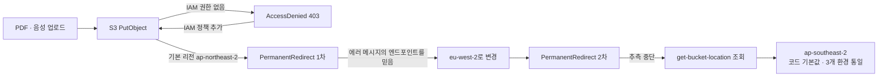
```mermaid
flowchart LR
  U["PDF · 음성 업로드"] --> A["S3 PutObject"]
  A -->|"IAM 권한 없음"| E0["AccessDenied 403"]
  E0 -->|"IAM 정책 추가"| A
  A -->|"기본 리전 ap-northeast-2"| E1["PermanentRedirect 1차"]
  E1 -->|"에러 메시지의 엔드포인트를 믿음"| G["eu-west-2로 변경"]
  G --> E2["PermanentRedirect 2차"]
  E2 -->|"추측 중단"| C["get-bucket-location 조회"]
  C --> F["ap-southeast-2<br/>코드 기본값 · 3개 환경 통일"]
```

**문제 원인**

채용 공고 PDF와 질문 음성, 답변 녹음은 모두 비공개 S3 버킷에 올립니다. S3 클라이언트는 `lib/s3.ts`에서 `process.env.AWS_REGION`을 읽고, 값이 없으면 코드에 적힌 기본 리전을 씁니다. 리전 값은 코드 기본값과 Vercel 환경변수 두 곳에 있었습니다.

배포 환경에서 업로드가 세 번 연달아 실패했습니다.

1. 처음에는 `AccessDenied: Access Denied`(HTTP 403)였습니다. IAM 사용자에게 버킷 권한이 없었고, 정책을 붙여 해결했습니다.
2. 다음은 `PermanentRedirect`였습니다. 코드 기본 리전이 `ap-northeast-2`(서울)였는데 버킷은 다른 리전에 있었습니다. 당시 기록한 에러 메시지에는 `eu-west-2` 엔드포인트가 적혀 있었고, 그 값을 그대로 코드 기본값과 Vercel `AWS_REGION`에 넣었습니다.
3. 같은 `PermanentRedirect`가 다시 났습니다. 이번 메시지는 다른 엔드포인트를 가리켰습니다.

   ```
   PermanentRedirect: The bucket you are attempting to access must be addressed
   using the specified endpoint: s3-ap-southeast-2.amazonaws.com
   ```

첫 번째 수정 때 코드에 남긴 주석이 당시 판단을 그대로 보여 줍니다.

```typescript
// S3 버킷 리전 (에러 메시지에서 확인: eu-west-2)
const BUCKET_REGION = process.env.AWS_REGION || 'eu-west-2';
```

첫 메시지에 왜 `eu-west-2`가 찍혔는지는 남은 기록으로 확인할 수 없습니다. 확인할 수 있는 것은 그 값을 버킷 설정과 대조하지 않고 코드에 넣었다는 것입니다. 두 번째 `PermanentRedirect`가 나고서야 메시지 대신 버킷 설정을 직접 조회했습니다.

**해결 과정**

- 에러 메시지를 해석하는 대신 버킷의 실제 리전을 직접 조회했습니다.

  ```bash
  aws s3api get-bucket-location --bucket <버킷 이름>
  # { "LocationConstraint": "ap-southeast-2" }
  ```

- 코드 기본값을 `ap-southeast-2`로 바꾸고 주석도 "실제 버킷 위치"로 고쳤습니다. Vercel Production · Preview · Development 세 환경의 `AWS_REGION`도 모두 같은 값으로 맞췄습니다. 환경변수가 있으면 그 값이, 없으면 코드 기본값이 쓰이므로 하나만 고치면 어느 환경에서는 옛 값이 남습니다.
- 버킷을 서울 리전으로 옮기는 방법도 문서에 정리해 두었지만 택하지 않았습니다. S3 버킷은 리전을 바로 옮길 수 없고 새 버킷을 만든 뒤 데이터를 복사해야 합니다. 설정을 실제 위치에 맞추는 편이 작업 범위가 작았습니다.

**테스트**

- 환경: Vercel Production 배포본
- 확인 절차: `vercel --prod --force`로 재배포 → 채용 공고 PDF 업로드 → `vercel logs --prod`에 `PermanentRedirect`가 남지 않는지 확인

**결과** 코드 기본값과 세 환경의 `AWS_REGION`이 실제 버킷 위치와 일치하게 되었습니다.

**배운 점** 에러 메시지로 짐작하기 전에 `get-bucket-location`처럼 실제 설정부터 조회해야 합니다.

핵심 코드: `lib/s3.ts` · 원문: [S3_REGION_FIX.md](docs/troubleshooting/S3_REGION_FIX.md) · [S3_REGION_UPDATE.md](docs/troubleshooting/S3_REGION_UPDATE.md) · [S3_ACCESS_DENIED_FIX.md](docs/troubleshooting/S3_ACCESS_DENIED_FIX.md)

### 배포 후 컬럼이 없어 나던 500을 재실행 안전한 마이그레이션으로 해결하고 인증 없는 관리자 API를 삭제

**문제 흐름**

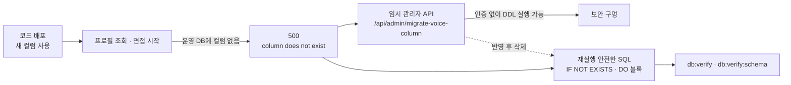
```mermaid
flowchart LR
  D["코드 배포<br/>새 컬럼 사용"] --> Q["프로필 조회 · 면접 시작"]
  Q -->|"운영 DB에 컬럼 없음"| E["500<br/>column does not exist"]
  E --> T["임시 관리자 API<br/>/api/admin/migrate-voice-column"]
  T -->|"인증 없이 DDL 실행 가능"| R["보안 구멍"]
  E --> M["재실행 안전한 SQL<br/>IF NOT EXISTS · DO 블록"]
  M --> V["db:verify · db:verify:schema"]
  T -.->|"반영 후 삭제"| M
```

**문제 원인**

운영 중에 컬럼을 두 차례 추가했습니다. 프로필 입력을 쉽게 하려고 `user_profiles`에 `current_job`, `career_summary`, `certifications`를 넣었고, 면접관 목소리를 6종 중에서 무작위로 고르려고 `interview_sessions`에 `voice`를 넣었습니다.

코드는 push하면 Vercel이 바로 배포하지만 Neon의 스키마는 따로 바꿔야 했습니다. 배포 과정에 마이그레이션 단계가 없었으므로 코드가 스키마보다 먼저 운영에 나갔습니다. 그 결과 아래 오류가 났습니다.

```
error: column p.current_job does not exist                              # 프로필 조회
POST /api/interview/start 500 (Internal Server Error)
column "voice" of relation "interview_sessions" does not exist         # 면접 시작
```

`voice` 컬럼을 운영 DB에 넣으려고 `POST /api/admin/migrate-voice-column` 엔드포인트를 만들어 배포한 뒤 curl로 호출했습니다. 그런데 이 엔드포인트에는 인증이 없었습니다. 주소만 알면 누구나 운영 DB에 DDL을 실행할 수 있는 상태였습니다.

처음 정리한 SQL에도 문제가 있었습니다. `ADD COLUMN voice ...`를 그대로 쓴 버전은 두 번째 실행에서 `ERROR: column "voice" already exists`로 실패합니다. 당시 문서에는 이 에러를 "정상"이라고 적었습니다. 실행할 때마다 사람이 에러를 보고 무시해도 되는지 판단해야 했습니다.

**해결 과정**

- 마이그레이션 SQL을 여러 번 실행해도 결과가 같도록 다시 썼습니다. 프로필 컬럼은 `ADD COLUMN IF NOT EXISTS`로, `voice`는 `information_schema`를 확인하는 `DO` 블록으로 작성했습니다.

  ```sql
  DO $$
  BEGIN
      IF NOT EXISTS (
          SELECT 1 FROM information_schema.columns
          WHERE table_name = 'interview_sessions' AND column_name = 'voice'
      ) THEN
          ALTER TABLE interview_sessions ADD COLUMN voice VARCHAR(20) DEFAULT 'nova';
          RAISE NOTICE 'Column "voice" added to interview_sessions table';
      ELSE
          RAISE NOTICE 'Column "voice" already exists in interview_sessions table';
      END IF;
  END $$;

  UPDATE interview_sessions SET voice = 'nova' WHERE voice IS NULL;
  ```

- `DEFAULT 'nova'`로 컬럼을 추가하면 기존 세션 행에도 `nova`가 들어가고, 뒤의 `UPDATE`는 NULL로 남은 행이 있을 때만 채웁니다. 무작위 선택은 새로 시작하는 면접에만 적용됩니다.
- 적용 스크립트(`db:migrate:profile`, `db:migrate:voice`)와 검증 스크립트(`db:verify`, `db:verify:schema`)를 분리했습니다.
- 반영이 끝난 뒤 임시 관리자 API를 삭제하고 스크립트로 대체했습니다.
- 이후 스키마 변경 절차를 백업(`pg_dump`) → 마이그레이션 SQL 적용 → 검증 스크립트 → 문제 시 롤백 SQL 또는 백업 복원 순서로 고정했습니다.
- 전체 스키마를 다시 실행하는 `db:migrate`는 운영 DB에 쓰지 않았습니다. 데이터를 지워도 되는 새 DB에만 쓰는 명령이기 때문입니다.

**테스트**

- 환경: PostgreSQL(Neon)
- 마이그레이션 스크립트가 끝에 `information_schema.columns`를 조회해 `voice`의 타입(`character varying`)과 기본값(`'nova'::character varying`)을 출력합니다.
- `npm run db:verify`로 `user_profiles`의 컬럼과 인덱스를, `npm run db:verify:schema`로 전체 테이블의 컬럼 타입과 인덱스를 스키마 정의와 대조했습니다.

**결과** 프로필 조회와 면접 시작이 정상 동작하고, 인증 없이 DDL을 실행하던 관리자 엔드포인트는 저장소에서 사라졌습니다.

**배운 점** 마이그레이션은 두 번 실행돼도 같은 결과가 나와야 하고, 운영 DB를 바꾸는 경로는 임시라도 인증 없이 열면 안 됐습니다.

핵심 코드: `database/migrations/add-voice-column.sql` · `database/migrations/add-profile-fields.sql` · `scripts/verify-db-schema.js` · 원문: [MIGRATION_GUIDE.md](docs/database/MIGRATION_GUIDE.md) · [VOICE_MIGRATION.md](docs/database/VOICE_MIGRATION.md) · [ADD_VOICE_COLUMN_MIGRATION.md](docs/database/ADD_VOICE_COLUMN_MIGRATION.md)

### 점수만으로는 무엇을 고칠지 알 수 없던 문제를 구조화된 피드백으로 바꾸고 기존 데이터를 살림

**문제 흐름**

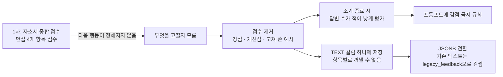
```mermaid
flowchart LR
  V1["1차: 자소서 종합 점수<br/>면접 4개 항목 점수"] -->|"다음 행동이 정해지지 않음"| P["무엇을 고칠지 모름"]
  P --> V2["점수 제거<br/>강점 · 개선점 · 고쳐 쓴 예시"]
  V2 --> C1["조기 종료 시<br/>답변 수가 적어 낮게 평가"]
  C1 --> R["프롬프트에 감점 금지 규칙"]
  V2 --> C2["TEXT 컬럼 하나에 저장<br/>항목별로 꺼낼 수 없음"]
  C2 --> J["JSONB 전환<br/>기존 텍스트는 legacy_feedback으로 감쌈"]
```

**문제 원인**

처음 버전은 자기소개서에 종합 점수(`overall_score`)를, 면접에는 태도 · 내용 · 일관성 · 직무 적합성 네 항목 점수를 줬습니다. 그런데 72점이라는 숫자를 받아도 다음에 무엇을 해야 할지가 정해지지 않았습니다.

점수를 없애는 작업과 함께 풀어야 할 문제가 두 가지 있었습니다.

- 답변이 1개 이상이면 면접을 일찍 끝낼 수 있게 바꾸자, 답변 수가 적은 면접을 LLM이 부정적으로 평가하는 문제가 생겼습니다(아래 프롬프트 규칙의 "점수"도 이 뜻입니다).
- 면접 턴별 피드백이 `interview_turns.feedback_text` TEXT 컬럼 하나에 들어 있어 강점과 개선점을 따로 꺼내 보여 줄 수 없었습니다. 그리고 이 컬럼에는 이미 쌓인 데이터가 있었습니다.

**해결 과정**

- 점수를 모두 제거했습니다. 자기소개서는 "수석 채용 담당자" 페르소나와 평가 기준 다섯 가지(명확성 · 직무 적합성 · STAR · 구체성 · 차별성)를 두고 강점, 약점, 고쳐 쓴 예시, 예상 면접 질문을 주게 했습니다. 출력 JSON 예시(few-shot)와 `response_format: json_object`를 쓰고 `temperature`는 0.5에서 0.7로 올렸습니다.
- 면접은 답변한 모든 턴에 요약, 강점, 개선점, STAR 형식 모범 답안을 만들게 했습니다.
- 조기 종료일 때는 프롬프트에 다음 규칙을 넣었습니다.

  ```
  - 질문 수가 적다고 절대로 점수를 깎지 마세요.
  - 제공된 질문/답변만 분석하고, "더 많은 질문이 있었다면..."과 같은 가정은 하지 마세요.
  ```

- 턴별 피드백을 `user_answer_summary` / `strengths` / `improvements` / `better_answer_example` 구조의 JSONB로 바꿨습니다. 조회용 GIN 인덱스 2개(`interview_turns.feedback_text`, `interview_sessions.final_feedback_json`)를 추가했습니다.
- 기존 텍스트를 새 구조로 변환하지 않았습니다. 이미 JSON 객체 형태인 값만 그대로 캐스팅하고, 나머지는 `{"legacy_feedback": ...}`로 감싸 같은 컬럼에 넣었습니다. 자유 텍스트를 네 필드로 쪼개는 변환은 실패하거나 내용을 잘못 나눌 수 있지만, 감싸기는 원문을 그대로 보존합니다.

  ```sql
  ALTER TABLE interview_turns
  ALTER COLUMN feedback_text TYPE JSONB USING
    CASE
      WHEN feedback_text IS NULL THEN NULL
      WHEN feedback_text::text ~ '^[\s]*\{' THEN feedback_text::jsonb
      ELSE json_build_object('legacy_feedback', feedback_text)::jsonb
    END;
  ```

- 실행 스크립트(`db:migrate:feedback`)는 이 SQL을 `BEGIN` / `COMMIT`으로 감싸고, 중간에 실패하면 `ROLLBACK`합니다. `{`로 시작하지만 올바른 JSON이 아닌 값이 있으면 캐스팅이 실패하는데, 이 경우에도 컬럼이 반쯤 바뀐 상태로 남지 않습니다.

**테스트**

- 환경: PostgreSQL(Neon), 기능 문서([INTERVIEW_EARLY_FINISH.md](docs/features/INTERVIEW_EARLY_FINISH.md))에 적어 둔 수동 테스트 시나리오
- 답변 0개: 조기 종료 버튼이 비활성화되고 "최소 1개 이상의 질문에 답변해야 조기 종료할 수 있습니다" 툴팁이 뜨는지 봅니다.
- 답변 2개 후 조기 종료: 2개 질문에 대한 피드백이 나오는지, `interview_sessions`의 `status`가 `completed`이고 `final_feedback_json->'is_early_finish'`가 `true`인지 SQL로 봅니다.
- 5개를 모두 답한 정상 완료와 조기 종료의 피드백 문구를 비교합니다.
- 마이그레이션 스크립트는 끝에 `information_schema.columns`와 `pg_indexes`를 조회해 JSONB 타입과 GIN 인덱스를 출력합니다. `npm run db:verify:schema`로 스키마 정의와 한 번 더 대조했습니다.

**결과** 새 피드백은 항목별로 나뉘어 화면에 보이고, 전환 전에 저장된 피드백도 잃지 않고 읽힙니다.

**배운 점** 평가 결과의 형식이 사용자의 다음 행동을 정하고, 스키마를 바꿀 때 옛 데이터는 변환하지 않고 감싸는 방법도 있습니다.

핵심 코드: `lib/openai.ts` · `database/migrations/update-interview-feedback-structure.sql` · `scripts/run-feedback-migration.js` · 원문: [IMPLEMENTATION.md](docs/IMPLEMENTATION.md) · [MIGRATION_GUIDE.md](docs/database/MIGRATION_GUIDE.md)

### 질문 음성이 재생되지 않던 문제를 Presigned URL로 해결

**문제 흐름**

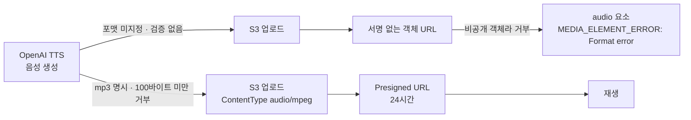
```mermaid
flowchart LR
  G["OpenAI TTS<br/>음성 생성"] -->|"포맷 미지정 · 검증 없음"| U["S3 업로드"]
  U --> URL["서명 없는 객체 URL"]
  URL -->|"비공개 객체라 거부"| X["audio 요소<br/>MEDIA_ELEMENT_ERROR: Format error"]
  G -->|"mp3 명시 · 100바이트 미만 거부"| U2["S3 업로드<br/>ContentType audio/mpeg"]
  U2 --> P["Presigned URL<br/>24시간"]
  P --> OK["재생"]
```

**문제 원인**

면접 질문은 서버에서 OpenAI TTS로 음성을 만들고 S3에 올린 뒤 브라우저의 `<audio>` 요소로 재생합니다. 이 질문 음성이 브라우저에서 재생되지 않았고, 콘솔에는 아래 에러만 남았습니다.

```
MEDIA_ELEMENT_ERROR: Format error (code 4)
NotSupportedError: Failed to load because no supported source was found.
```

이름은 "Format error"지만 이 에러는 파일 포맷이 깨졌을 때만 나는 것이 아닙니다. 요청이 거부되어 오디오가 아닌 응답을 받았을 때도 `<audio>` 요소는 같은 코드 4를 낼 수 있습니다. 그래서 원인을 한 곳으로 좁히지 않고 음성이 지나가는 경로를 단계별로 나눠 봤습니다.

- 생성: TTS 호출에 출력 포맷을 지정하지 않았습니다. 재생 쪽 `<audio>`에도 소스 타입을 적지 않았습니다.
- 검증: TTS가 돌려준 버퍼를 확인하지 않고 그대로 올렸습니다. 비어 있거나 잘린 응답이 와도 업로드 단계에서 걸러지지 않았습니다.
- 권한: 버킷은 비공개인데 화면에는 서명 없는 S3 객체 URL을 내려줬습니다. 브라우저가 이 URL을 요청하면 S3가 거부합니다.

문서에는 S3 객체의 `Content-Type` 누락과 버킷 CORS 설정도 원인 후보로 적어 두었습니다. 실제로 재생을 막은 것은 권한 문제였습니다. 포맷 명시와 버퍼 검사는 같은 증상이 다른 이유로 다시 나지 않도록 함께 넣었습니다.

**해결 과정**

- 생성: `response_format: 'mp3'`를 명시했습니다. OpenAI TTS의 기본 출력도 mp3이지만 기본값에 기대지 않았습니다. S3 업로드에는 `ContentType: 'audio/mpeg'`를, 화면에는 `<source type="audio/mpeg">`를 지정해 세 곳의 포맷을 맞췄습니다. `<audio>`에 `crossOrigin="anonymous"`를 붙였기 때문에 버킷 CORS에서 앱 도메인의 GET을 허용했습니다.
- 검증: TTS 버퍼가 100바이트 미만이면 에러로 처리하고, S3 업로드 직전에도 같은 검사를 한 번 더 합니다. MP3 헤더(`0xFF` 프레임 동기 또는 `ID3`)도 확인하지만 이 검사는 경고 로그만 남기고 막지는 않습니다.

  ```typescript
  if (buffer.length < 100) {
    throw new Error('생성된 오디오가 유효하지 않습니다.');
  }
  const isValidMP3 = buffer[0] === 0xFF ||
                     (buffer[0] === 0x49 && buffer[1] === 0x44 && buffer[2] === 0x33); // ID3
  if (!isValidMP3) {
    console.warn(/* ... */); // 경고 로그만 남기고 계속 진행
  }
  ```

- 권한: 문서에는 버킷 정책으로 전체 객체를 공개 읽기(`s3:GetObject`, `Principal: "*"`)로 열거나 객체 ACL을 `public-read`로 거는 방법도 적어 두었습니다. 하지만 버킷에는 질문 음성뿐 아니라 사용자의 답변 녹음과 자기소개서 PDF도 들어갑니다. 그래서 버킷은 비공개로 두고, 업로드할 때 `GetObject`에 대한 Presigned URL(24시간)을 발급해 그 URL로만 재생하게 했습니다.
- 나중에 이 방식의 빈틈을 하나 더 고쳤습니다. 업로드 때 발급한 Presigned URL을 DB에 그대로 저장했기 때문에, 하루가 지나면 지난 면접의 녹음과 공고 PDF를 열 수 없었습니다. 조회 API(`pages/api/interview/result/[id].ts`, `pages/api/job-postings/[id].ts`)가 저장된 URL 대신 `refreshPresignedUrl()`로 다시 서명한 URL을 내려주도록 바꿨습니다.

**테스트**

- 환경: Vercel 배포본, 브라우저 개발자 도구
- 확인 절차는 세 단계입니다.
  - 서버 로그에 `[TTS] Speech generated successfully (N bytes)` → `[S3 Upload] Successfully uploaded`가 순서대로 찍히는지 봅니다.
  - 브라우저 콘솔에 로드 시작 → 재생 가능 → 재생 시작 → 재생 종료 이벤트가 차례로 찍히는지 봅니다.
  - Network 탭에서 음성 응답의 `Content-Type: audio/mpeg`과 `Content-Length`를 봅니다.

**결과** 버킷을 공개하지 않고도 질문 음성이 재생되고, 비어 있는 음성 파일은 업로드 단계에서 걸러집니다.

**배운 점** `<audio>`의 "Format error"는 요청이 거부됐을 때도 나므로, 에러 이름만 보지 말고 Network 탭의 실제 응답부터 봐야 했습니다.

핵심 코드: `lib/openai.ts`(`textToSpeech`) · `lib/s3.ts`(`uploadToS3`, `refreshPresignedUrl`) · `components/InterviewPage.tsx` · 원문: [TTS_AUDIO_FIX.md](docs/troubleshooting/TTS_AUDIO_FIX.md)

### LLM이 문자열 자리에 객체를 넣어 화면이 깨지던 문제를 서버와 화면 양쪽 정규화로 해결

**문제 흐름**

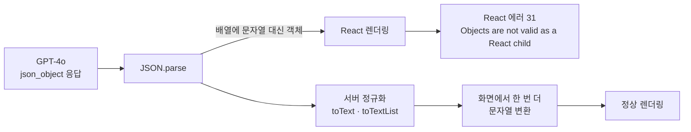
```mermaid
flowchart LR
  L["GPT-4o<br/>json_object 응답"] --> P["JSON.parse"]
  P -->|"배열에 문자열 대신 객체"| R["React 렌더링"]
  R --> E["React 에러 31<br/>Objects are not valid as a React child"]
  P --> N["서버 정규화<br/>toText · toTextList"]
  N --> C["화면에서 한 번 더<br/>문자열 변환"]
  C --> OK["정상 렌더링"]
```

**문제 원인**

자기소개서 피드백은 GPT-4o에 `response_format: { type: 'json_object' }`를 걸고, 응답을 `JSON.parse`해 화면에 그대로 그렸습니다. 화면은 `strengths`, `weaknesses` 같은 필드가 문자열 배열이라고 가정했습니다.

그런데 모델이 배열 안에 문자열 대신 `{ issue, suggestion }` 같은 객체를 넣어 보내는 경우가 있었습니다. 이 값을 JSX에 그대로 넣자 React 에러 #31(`Objects are not valid as a React child`)이 나며 화면이 깨졌습니다. 필드 이름을 `weaknesses` 대신 `improvements`로 바꿔 보내는 경우도 있었습니다.

`json_object` 모드는 응답이 문법적으로 올바른 JSON이라는 것만 보장합니다. 필드 이름과 값의 타입까지 프롬프트대로 온다는 보장은 없습니다. 스키마를 강제하는 `json_schema`(Structured Outputs)는 쓰지 않았습니다. 이 기능은 파싱에 성공한 값을 곧바로 화면에 넘기고 있어서, 모델 출력의 형태가 바뀌면 그대로 화면 오류가 되었습니다.

**해결 과정**

- 서버(`lib/openai.ts`)에서 응답을 화면이 기대하는 스키마로 정규화한 뒤에 돌려주게 했습니다.

  ```typescript
  // LLM이 문자열 대신 {issue, suggestion} 같은 객체를 주면 String()은 "[object Object]"가 된다.
  // 알려진 필드를 꺼내 문장으로 만들고, 그래도 없으면 JSON 문자열로 남긴다.
  function toText(value: any): string {
    if (typeof value === 'string') return value;
    if (value && typeof value === 'object') {
      const parts = ['issue', 'point', 'text', 'description', 'suggestion', 'example']
        .map((key) => value[key])
        .filter((v) => typeof v === 'string' && v.trim() !== '');
      return parts.length > 0 ? parts.join(' — ') : JSON.stringify(value);
    }
    return value == null ? '' : String(value);
  }
  ```

- 배열이 아닌 값은 빈 배열로 바꾸고, 바뀐 필드 이름도 받습니다(`parsed.weaknesses ?? parsed.improvements`). 고쳐 쓴 예시는 최대 3개, 면접 턴별 강점과 개선점도 각각 최대 3개로 자릅니다.
- 알려진 필드가 하나도 없는 객체도 버리지 않고 `JSON.stringify`로 남깁니다. 보기에는 덜 깔끔해도 모델이 준 내용이 화면에서 사라지지는 않습니다.
- 화면(`app/cover-letters/[id]/page.tsx` 등)에서도 렌더링 직전에 타입을 한 번 더 확인해, 객체면 문자열로 바꿔 그립니다. 서버 정규화를 거치지 않은 값이 들어와도 화면 전체가 깨지지는 않습니다.

**테스트**

- 이 수정만을 위한 테스트 시나리오는 남아 있지 않습니다.

**결과** 모델이 문자열 자리에 객체를 보내거나 필드 이름을 바꿔도 화면이 깨지지 않고 내용이 문장으로 표시됩니다.

**배운 점** `json_object`는 JSON 문법만 보장하므로, 화면에 넘기기 전에 서버에서 필드 이름과 타입을 맞춰야 합니다.

핵심 코드: `lib/openai.ts`(`toText`, `toTextList`) · `app/cover-letters/[id]/page.tsx` · 원문: [IMPLEMENTATION.md](docs/IMPLEMENTATION.md)

### Preview 배포에서만 나던 CORS 에러를 상대 경로 API 호출로 해결

**문제 흐름**

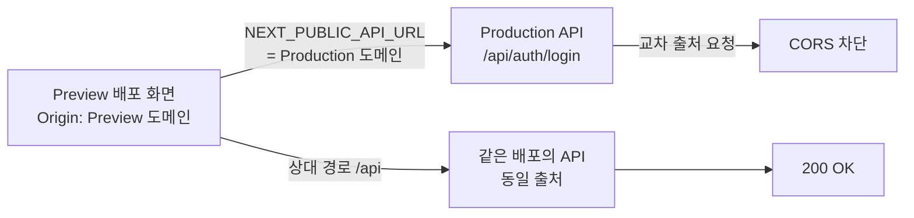
```mermaid
flowchart LR
  B["Preview 배포 화면<br/>Origin: Preview 도메인"] -->|"NEXT_PUBLIC_API_URL<br/>= Production 도메인"| A["Production API<br/>/api/auth/login"]
  A -->|"교차 출처 요청"| X["CORS 차단"]
  B -->|"상대 경로 /api"| S["같은 배포의 API<br/>동일 출처"]
  S --> OK["200 OK"]
```

**문제 원인**

Vercel은 Production 외에 브랜치와 커밋마다 Preview 배포를 만듭니다. Preview 배포에서 로그인하면 아래 에러로 막혔고, Production에서는 정상이었습니다.

```
Access to fetch at 'https://ai-service2-6.vercel.app/api/auth/login'
from origin 'https://your-app-git-xxxx.vercel.app'
has been blocked by CORS policy
```

Origin의 Preview 도메인은 원문 기록에 자리표시자로 적혀 있습니다.

요청 URL과 Origin의 도메인이 서로 달랐습니다. Preview 화면이 자기 배포의 API가 아니라 Production의 API를 부르고 있었습니다. API 클라이언트(`lib/api-client.ts`)는 기준 주소를 `process.env.NEXT_PUBLIC_API_URL`에서 읽었습니다. `vercel env ls`로 확인해 보니 이 변수가 Production · Preview · Development 세 환경 모두에 Production 도메인으로 등록되어 있었습니다.

`NEXT_PUBLIC_` 변수는 빌드할 때 클라이언트 번들에 값이 박힙니다. 그래서 Preview 빌드의 화면 코드에도 Production 주소가 들어갔습니다. 브라우저 입장에서는 다른 출처로 보내는 요청이고, Production API가 Preview 출처를 허용하는 응답을 주지 않아 차단되었습니다.

**해결 과정**

- `NEXT_PUBLIC_API_URL`을 세 환경에서 모두 지우고, API 클라이언트의 기준 주소를 빈 문자열로 바꿔 상대 경로(`/api`)로 호출하게 했습니다.

  ```typescript
  // Before: Preview에서도 Production URL을 사용
  const API_URL = process.env.NEXT_PUBLIC_API_URL || '';
  // After: 각 배포가 자기 도메인의 /api를 호출
  const API_URL = '';
  ```

- Preview 주소는 배포마다 바뀌어 환경변수에 고정 값을 넣어 둘 수 없습니다. Vercel 시스템 변수 `VERCEL_URL`로 주소를 조립하는 방법도 있지만, 화면과 API가 같은 앱이라 상대 경로가 더 단순했습니다. 상대 경로로 부르면 각 배포가 자기 도메인의 API를 호출하므로 환경이 몇 개든 설정할 것이 없습니다. 화면과 API를 한 Next.js 앱에서 함께 배포하기 때문에 가능한 방법이고, API를 다른 도메인에 따로 둔다면 이 변수가 다시 필요합니다.
- Production API에 Preview 출처를 허용해도 에러는 사라지지만, 그러면 Preview 화면이 자기 배포의 API 대신 Production API를 계속 부르게 됩니다. 화면과 API가 같은 출처가 되면 브라우저는 CORS 검사를 하지 않습니다. 그 밖의 출처를 위해 서버의 `withCors` 래퍼에 허용 목록(localhost · Production 도메인)을 두었습니다. 처음에는 Preview 도메인 패턴(`/https:\/\/ai-service2-6-.*\.vercel\.app$/`)도 넣었지만, 같은 접두사로 이름을 지은 다른 사람의 Vercel 프로젝트까지 통과할 만큼 넓었습니다. 상대 경로로 바꾼 뒤에는 Preview 화면이 자기 배포의 API를 부르므로 필요 없어져 지웠습니다. 허용된 Origin에만 `Access-Control-Allow-Origin`을 돌려주고(개발 환경은 모두 허용), `OPTIONS` preflight에는 바로 응답합니다.

**테스트**

- 환경: Vercel Preview와 Production 배포본, Chrome 개발자 도구
- 확인 절차: `vercel env ls`에서 `NEXT_PUBLIC_API_URL`이 더 나오지 않는지 보고 Preview와 Production에서 각각 로그인
- Network 탭 기록상 수정 후 요청은 `Request URL`과 `Origin`이 같은 Preview 도메인이고 응답은 `200 OK`입니다.

**결과** Preview 배포에서도 로그인이 되고, 새 Preview가 생겨도 API 주소를 따로 설정할 필요가 없어졌습니다.

**배운 점** `NEXT_PUBLIC_` 값은 빌드 때 고정되므로, 배포마다 달라지는 주소는 환경변수보다 상대 경로로 푸는 편이 단순했습니다.

핵심 코드: `lib/api-client.ts` · `lib/middleware.ts`(`withCors`) · 원문: [CORS_FIX_GUIDE.md](docs/troubleshooting/CORS_FIX_GUIDE.md)

## 아키텍처

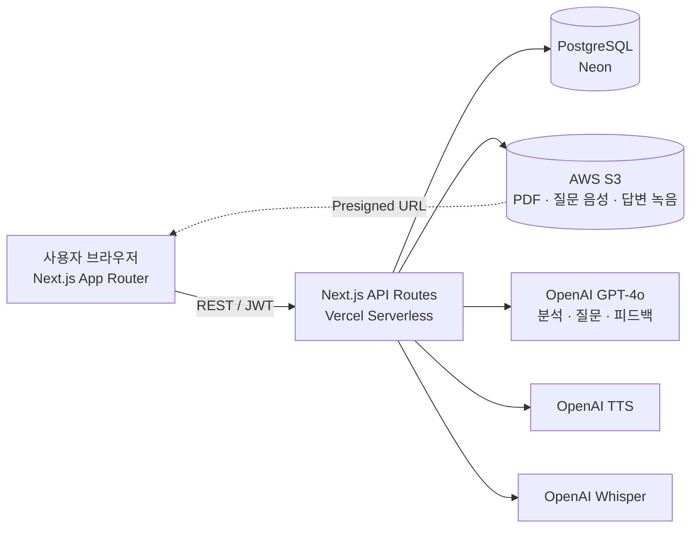
```mermaid
flowchart LR
    U["사용자 브라우저<br/>Next.js App Router"] -->|"REST / JWT"| API["Next.js API Routes<br/>Vercel Serverless"]
    API --> DB[("PostgreSQL<br/>Neon")]
    API --> S3[("AWS S3<br/>PDF · 질문 음성 · 답변 녹음")]
    API --> GPT["OpenAI GPT-4o<br/>분석 · 질문 · 피드백"]
    API --> TTS["OpenAI TTS"]
    API --> STT["OpenAI Whisper"]
    S3 -. "Presigned URL" .-> U
```

- 답변 한 번마다 서버리스 함수 한 번 안에서 음성 인식, 다음 질문 생성, 음성 합성, S3 업로드를 모두 처리합니다. 그래서 `vercel.json`에서 API 함수 최대 실행 시간을 처음부터 60초로 잡았습니다.
- 서버리스라 인스턴스가 여러 개 뜹니다. 커넥션 풀은 인스턴스마다 싱글턴으로 재사용하고, `pg`와 `pdf-parse`는 번들에서 제외했습니다.
- 사용자가 채용 공고와 자기소개서를 PDF로 올리면 `pdf-parse`로 텍스트를 뽑아 분석에 씁니다. PDF는 S3에 보관합니다.
- 면접 질문은 매 턴 현재 직무, 경력 요약, 자격증, 공고 분석 결과, 자기소개서, 지금까지의 질의응답을 함께 넣어 만듭니다.

## 기술 스택

| 구분 | 기술 | 선택한 이유 |
| --- | --- | --- |
| 언어 | TypeScript | 화면과 API를 한 저장소에서 다루면서 타입을 공유하려고 썼습니다 |
| 프레임워크 | Next.js 14 (화면 App Router, API Pages Router), React 18, Tailwind CSS | 1인 개발이라 프런트와 API를 한곳에서 관리하는 편이 빨랐습니다 |
| 데이터베이스 | PostgreSQL (Neon), `pg` 커넥션 풀로 직접 쿼리 | 테이블 7개 규모라 ORM을 두지 않고 쿼리를 직접 썼습니다 |
| AI | OpenAI GPT-4o, TTS(tts-1-hd), Whisper | 공고 분석과 질문 생성, 음성 합성, 음성 인식을 한 공급자로 묶었습니다 |
| 스토리지 | AWS S3 (비공개 버킷 + Presigned URL) | 음성 파일을 공개하지 않으면서 재생할 수 있어야 했습니다 |
| 인증 | JWT, bcrypt | |
| 배포 | Vercel (Production · Preview · Development) | |

## 역할과 기여도

혼자 기획부터 배포까지 모두 했습니다.

- API Routes 20개(인증, 공고 분석, 자기소개서 피드백, 면접 진행, 히스토리 조회)를 만들고 `withAuth` · `withCors` · `withErrorHandler` 래퍼로 공통 처리를 묶었습니다.
- PostgreSQL 테이블 7개를 설계했습니다. 기본 인덱스 9개와 GIN 인덱스 2개, `updated_at` 자동 갱신 트리거 5개를 두었습니다.
- 공고 분석 결과를 저장해 두고 자기소개서 피드백과 매 턴 면접 질문에 다시 쓰는 구조를 만들었습니다.
- 질문 음성 생성, 녹음, 음성 인식, 다음 질문 생성을 한 요청 안에서 처리하는 음성 면접 흐름을 만들었습니다.
- 비공개 S3 버킷과 Presigned URL로 음성 파일을 다루고, Vercel 세 환경에 배포하며 환경별 설정을 나눴습니다.

## 결과

**동작 확인** 자동화 테스트는 없습니다. 기능별 문서에 수동 테스트 시나리오를 적어 두고 확인했습니다. 조기 종료에서 답변이 0개, 일부, 전부인 경우, 히스토리 조회와 삭제, 맥락 기반 질문이 나오는지 등입니다. 데이터베이스는 `npm run db:verify`와 `npm run db:verify:schema`로 컬럼 타입과 인덱스까지 검증했습니다. 장애는 클라이언트와 API 단계마다 로그를 넣어 범위를 좁혔습니다.

**질문 품질** 처음에는 기본 프로필만 넣어서 지원자가 달라도 비슷한 질문이 나왔습니다. 매 턴 현재 직무, 경력 요약, 자격증, 공고 분석 결과, 자기소개서, 지금까지의 대화를 함께 넣도록 바꾸자 지원 공고에 맞는 질문이 나왔습니다. 대신 질문당 토큰이 약 500에서 800~1,000으로 늘었습니다. 품질은 질문을 직접 읽어 보고 판단했고, 숫자로 잰 것은 토큰 증가뿐입니다.

**설정 정리** Vercel 환경변수 이름이 `S3_BuCKET_NAME`으로 잘못 적혀 있어 코드가 하드코딩된 기본 버킷 이름으로 동작하고 있었습니다. 당장은 문제가 없지만 버킷을 바꾸면 깨지는 상태였습니다. 오타를 고치고 Vercel Storage 연동으로 자동 생성된 `storage_*` 변수 19개를 정리 대상으로 정해, 실제로 쓰는 변수 7개만 남겼습니다(26개 → 7개).

**주요 설정값**

| 항목 | 값 |
| --- | --- |
| 면접 질문 수 / 답변 시간 | 5개 / 60초 |
| GPT-4o temperature | 공고 분석 0.3, 나머지 0.7 |
| Vercel API 최대 실행 시간 | 60초 |
| DB 커넥션 풀 | 최대 20, idle 30초 |
| JWT 만료 / bcrypt salt rounds | 7일 / 10 |
| S3 Presigned URL | 24시간 |
| 업로드 제한 | PDF 10MB, 텍스트 50~50,000자 |

## 실행 방법

```bash
npm install
cp .env.example .env          # DATABASE_URL · AWS · OPENAI_API_KEY · JWT_SECRET
cp .env .env.local

npm run db:migrate            # 새 DB: 전체 스키마 생성 (한 번만)
DATABASE_URL=... npm run db:verify:schema

npm run dev                   # http://localhost:3000
```

기존 데이터베이스 업그레이드와 배포 절차는 [DEPLOYMENT.md](docs/guides/DEPLOYMENT.md)와 [MIGRATION_GUIDE.md](docs/database/MIGRATION_GUIDE.md)에 있습니다.

## 문서

- [구현 상세](docs/IMPLEMENTATION.md) · [트러블슈팅 10건](docs/TROUBLESHOOTING.md)
- [배포 가이드](docs/guides/DEPLOYMENT.md) · [환경 변수](docs/guides/ENVIRONMENT_VARIABLES.md)
- [기능 설계 문서](docs/features) · [DB 문서](docs/database) · [문서 목록](docs/README.md)

## License

[MIT](LICENSE)
